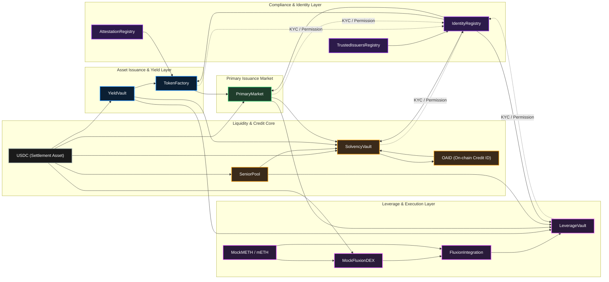

```text
________                                  _____                         __            
\_____  \ ______   ____   ____           /  _  \   ______ ______  _____/  |_  ______  
 /   |   \\____ \_/ __ \ /    \         /  /_\  \ /  ___//  ___/_/ __ \\   __\/  ___/  
/    |    \  |_| \ ___/|   |  \       /    |    \\___ \ \___ \ \  ___/|  |  \___ \   
\_______  /   __/ \___  ____|  /       \____|__  /____  _____  _ \___  ___| /____ \  
        \/|__|        \/     \/                \/     \/     \/      \/          \/

```

<h2 align="center">
S E C U R E   •   L I Q U I D   •   T R A N S P A R E N T   •   F A I R
</h2>

<div align="center">
<br />
<sub><strong>PROTOCOL CORE ONBOARDING</strong></sub>
<h1>Backend & Smart Contract Setup</h1>
<p><em>The engine room of OpenAssets: NestJS Orchestration, Event Indexing, and Mantle Smart Contracts.</em></p>
</div>

---

## Getting Started

### Prerequisites

* **Node.js**: v20.x or higher (v22+ Recommended)
* **Yarn**: For monorepo package management
* **Docker**: To run MongoDB and Redis locally
* **Hardhat**: For contract lifecycle management
* **env**: Two env's one in the backend folder as described later in the reading, one env in the contract folder with a private key configured for contract deployment.

### 1. Clone & Install

```bash
git clone https://github.com/TheOpenAssets/TOA-Server-Mantle.git
cd TOA-Server-Mantle
yarn install
```


### 2. Deploy Contracts

Deploy and auto-link the 18+ protocol contracts on Mantle Sepolia:

```bash
cd packages/contracts
npx harhdhat init
npx hardhat compile
npx hardhat run scripts/deploy/deploy_all.ts --network mantleSepolia
```

### 4. Start Backend

```bash
cd packages/backend
yarn dev
```

---

## Architecture

OpenAssets is built as a **High-Throughput Yarn Monorepo**. It separates concerns into specialized packages to handle the complexities of RWA tokenization and credit.

* **`packages/backend`**: The NestJS heart. Manages API routes, automated keepers, and external webhooks.
* **`packages/contracts`**: Solidity source for the Mantle execution layer.
* **`packages/types`**: Shared interfaces ensuring type-safety across the entire stack.

---



---

## Environment Variables (.env)

The protocol requires a robust set of environment variables to manage security, connectivity, and contract logic.

### **1. Backend & Auth Config**

| Variable | Description |
| --- | --- |
| `JWT_SECRET` | Secret key for signing authentication tokens |
| `JWT_ACCESS_TOKEN_EXPIRES_IN` | Validity duration for access tokens |
| `MONGODB_URI` | Connection string for RWA metadata and indexer storage |
| `REDIS_HOST` / `REDIS_PORT` | Configuration for high-speed caching and locks |
| `TYPEFORM_WEBHOOK_SECRET` | Security secret for issuer onboarding webhooks |

### **2. Blockchain & Deployment**

| Variable | Description |
| --- | --- |
| `MANTLE_RPC_URL` / `MANTLE_WSS_URL` | Mantle Network provider endpoints |
| `CHAIN_ID` | Set to `5003` for Mantle Sepolia |
| `ADMIN_PRIVATE_KEY` | Deployer and Admin authority key |
| `PLATFORM_PRIVATE_KEY` | Key for automated platform actions (Keepers) |
| `CUSTODY_WALLET_ADDRESS` | Central address for asset settlement custody |

### **3. Smart Contract Registry**

| Variable | Description |
| --- | --- |
| `IDENTITY_REGISTRY_ADDRESS` | ERC-3643 KYC/Identity facts |
| `TOKEN_FACTORY_ADDRESS` | Core RWA token generator |
| `YIELD_VAULT_ADDRESS` | Time-weighted yield distribution logic |
| `PRIMARY_MARKETPLACE_ADDRESS` | Fixed-price and Auction market engine |
| `LEVERAGE_VAULT` | mETH leverage and debt manager |
| `OAID` / `SOLVENCY_VAULT` | Universal Credit Identity and Collateral custody |
| `SENIOR_POOL` | Primary USDC liquidity lending pool |
| `SECONDARY_MARKETPLACE_ADDRESS` | P2P Trading Engine|
| `ATTESTATION_REGISTRY_ADDRESS` | Registry for on-chain attestations (e.g., KYC, accreditations) |
| `TRUSTED_ISSUERS_REGISTRY_ADDRESS` | Whitelist of approved issuers for RWA tokens |
| `USDC` | Address of the USDC stablecoin contract |
| `FAUCET` | Address of the testnet faucet for USDC |
| `MOCK_METH` | Address of the Mock mETH token contract |
| `METH_FAUCET` | Address of the testnet faucet for mETH |
| `MOCK_FLUXION_DEX` | Address of the Mock Fluxion DEX contract for price feeds |
| `FLUXION_INTEGRATION` | Contract integrating with Fluxion DEX for swaps |

### **4. System & Maintenance Keepers**

| Variable | Description |
| --- | --- |
| `HARVEST_INTERVAL_SECONDS` | Frequency of mETH yield-to-interest swaps |
| `HEALTH_CHECK_INTERVAL_SECONDS` | Frequency of LTV/Liquidation monitoring |
| `METH_PRICE_UPDATE_INTERVAL` | Cadence for mETH/USDC price feed refreshes |
| `ETHERSCAN_API_KEY` | For contract verification on Mantle Explorer |

---
<div align="center">
  <br />
  <sub><strong>THE ARCHITECTS</strong></sub>
  <p><em>Engineering the future of RWA liquidity on Mantle.</em></p>


  <a href="https://x.com/18_r_y_u_k_07"></a>
  <a href="https://x.com/Dead_Bytx"></a>
  <a href="https://x.com/Kaushaly4s5s7"></a>

<div>
    <sub> <em>Bob The Builder's</em></sub>
</div>

</div>

---

<div align="center">
  <br />
  
  <br />
  <br />
  <p>
    <strong>© 2026 OpenAssets. All rights reserved.</strong><br />
    Built with precision for the <strong>Mantle Network</strong> ecosystem.
  </p>
  <samp>
    Secure • Liquid • Transparent • Fair
  </samp>
  <br />
  <br />
  <p>
    <sub>Licensed under the MIT License. Developed for the Mantle Hackathon 2026.</sub>
  </p>
</div>

---

