# Doc 1 : (Overall tech / UX flow )

Created by: Divyraj Saini
Category: Proposal
Last edited by: Kaushal Chaudhari
Reviewers: Abhinav Pangaria, Kaushal Chaudhari
Stage: Approved
Text: Need review on this file .

# Build for Mantle Ecosystem - Product Sequence Diagram

## High-Level Overview of System Flows

---

## **Primary Asset Lifecycle: Onboarding to Settlement**

```mermaid
sequenceDiagram
    participant Originator as 🏢 Asset Originator
    participant Portal as Portal UI
    participant TruthEngine as Engine A<br/>(Truth Engine)
    participant CompEngine as Engine B<br/>(Compliance)
    participant EigenDA as ☁️ EigenDA
    participant Mantle as ⛓️ Mantle Chain
    participant Admin as 👤 Admin
    participant Investor as 💰 Investor
    participant Market as 🏪 Marketplace
    participant Vault as 💵 Yield Vault

    Note over Originator,Vault: PHASE 1: Asset Onboarding & Verification

    Originator->>Portal: Upload asset documents (invoices, contracts)
    Portal->>Portal: Client-side hash generation (keccak256)
    Portal->>Portal: Generate ZK proof locally

    Portal->>TruthEngine: Submit files + metadata + client hash
    TruthEngine->>TruthEngine: Split-flow validation:<br/>Stream A: Hash raw bytes<br/>Stream B: Encrypt & store

    alt Hash Mismatch
        TruthEngine-->>Portal: ❌ Reject (data corruption)
    else Hash Valid
        TruthEngine->>TruthEngine: Build Merkle tree (sorted, deterministic)
        TruthEngine->>TruthEngine: Generate attestation payload
        TruthEngine-->>Portal: ✅ Asset staged (PENDING_COMPLIANCE)
    end

    Note over CompEngine,EigenDA: PHASE 2: Compliance & Data Anchoring

    Admin->>Portal: Review compliance queue
    Admin->>CompEngine: Trigger KYC/compliance check

    CompEngine->>CompEngine: Verify issuer credentials
    CompEngine->>CompEngine: Validate asset documentation

    alt Compliance Failed
        CompEngine-->>Admin: ❌ Reject asset
    else Compliance Approved
        CompEngine->>CompEngine: Sign attestation (raw ECDSA)
        CompEngine->>TruthEngine: Store attestation signature

        TruthEngine->>EigenDA: Disperse Merkle bundle + metadata
        EigenDA-->>TruthEngine: Return BlobID (request confirmation)
        TruthEngine->>TruthEngine: Store anchorPointer (BlobID)
    end

    Note over Admin,Mantle: PHASE 3: On-Chain Registration & Tokenization

    Admin->>Mantle: Register asset on AttestationRegistry
    Note right of Mantle: Inputs: attestationHash,<br/>attestationSig, blobId, assetId

    Mantle->>Mantle: Verify signature against trusted attestor
    Mantle->>Mantle: Store canonical asset proof
    Mantle-->>Admin: ✅ Asset registered

    Admin->>Mantle: Deploy RWA token (ERC-3643 compliant)
    Mantle->>Mantle: Mint full supply to originator
    Note right of Mantle: Fixed supply, no future minting
    Mantle-->>Admin: ✅ Token deployed & minted

    Note over Investor,Vault: PHASE 4: Marketplace & Economic Activity

    Investor->>Market: Browse verified RWAs
    Market->>Mantle: Query token metadata & attestation status
    Mantle-->>Market: Return asset details + compliance state

    Investor->>Market: Purchase tokens (primary market)
    Market->>Mantle: Transfer tokens from originator
    Mantle->>Mantle: Compliance check: verify investor status
    Mantle-->>Investor: ✅ Tokens transferred

    opt Secondary Trading
        Investor->>Market: List tokens for sale
        Investor->>Market: Buy from peer (OTC)
        Market->>Mantle: Execute compliant transfer
    end

    Note over Admin,Vault: PHASE 5: Yield Distribution & Settlement

    Admin->>Vault: Record off-chain settlement (fiat received)
    Note right of Vault: FX conversion: Fiat → USDC

    Vault->>Vault: Update global yield index for asset
    Note right of Vault: Proportional distribution formula

    Investor->>Vault: Claim accumulated yield
    Vault->>Vault: Calculate: (globalIndex - userLastIndex) × balance
    Vault-->>Investor: 💰 Transfer USDC yield

```

---

## **Cross-Chain Asset Bridging Flow**

---

## **Verification & Audit Flow**

---

## **Key Insights & Unique Characteristics**

### **1. Split-Flow Architecture (Truth Engine Innovation)**

The system processes data through two parallel streams:

- **Stream A**: Pure cryptographic hashing of raw bytes for integrity
- **Stream B**: Encrypted storage for privacy
- **Assertion Point**: Client hash must match server hash before proceeding

**Why This Matters**: Prevents data tampering at ingestion while maintaining privacy. The originator proves they submitted authentic data without revealing it.

---

### **2. Mantle as Canonical Source of Truth**

Unlike typical multi-chain RWA platforms where assets exist equally on all chains:

- **Mantle holds the authoritative attestation registry**
- Other chains (Base, etc.) are "execution mirrors" not authorities
- Cross-chain validation always references back to Mantle state

**Competitive Advantage**: Eliminates fragmented truth problem in multi-chain RWA systems. One canonical source, infinite execution venues.

---

### **3. EigenDA as Privacy Layer, Mantle as State Layer**

Strategic separation of concerns:

- **EigenDA**: Raw documents, Merkle bundles (heavy, private data)
- **Mantle**: Commitments, hashes, lifecycle state (lightweight, public proofs)

**Efficiency Gain**: Mantle validators don't need to process/store gigabytes of invoice PDFs. They only verify 32-byte commitments.

---

### **4. Compliance-First Transfer Logic**

Tokens aren't freely transferable; they enforce:

- **Marketplace-only transfers**: Tokens can only move through authorized marketplace contract
- **KYC verification hook**: Every transfer checks AttestationRegistry for investor status
- **Revocation enforcement**: If asset attestation is revoked, all transfers freeze

**Regulatory Positioning**: Built for jurisdictions requiring T+0 compliance, not wild-west DeFi.

---

### **5. Index-Based Yield Distribution (Gas Optimization)**

Instead of pushing yield to every holder individually:

- **Global index** updates once per settlement
- **User checkpoints** track last-claimed position
- **Pull-based claiming**: Investors claim when ready

**Scale**: Supports thousands of token holders without gas explosion. Settlement cost: O(1) not O(n).

---

### **6. Defensive Relayer (Firewall Architecture)**

The cross-chain relayer isn't a blind forwarder:

- **Pre-flight DA check**: Fetches EigenDA blob and verifies hash match
- **Registry health check**: Confirms attestation not revoked before submitting
- **Idempotency enforcement**: DB-level locks prevent double-sends

**Security**: Even if source chain emits malicious event, relayer acts as validation firewall.

---

### **7. Zero-Knowledge Proofs as Optional Verifiability Layer**

ZK proofs aren't consensus-critical, they're audit-critical:

- **Circuit**: Proves "I know invoice totaling $X" without revealing invoice
- **Client-side verification**: Auditors run snarkjs in browser, no backend trust
- **Fingerprinting**: Circuit verification key is hashed and stored, preventing proof spoofing

**Auditability**: Judges can verify asset authenticity without seeing confidential business documents.

---

### **8. Fixed-Supply, Fully-Backed Token Model**

Each RWA token represents:

- **Fractional claim** on future cash flows
- **No dilution**: Supply minted once at creation
- **No unbacked minting**: Every token maps to specific attested asset

**Investor Confidence**: Unlike rebasing tokens or algorithmic supplies, every token is backed 1:1 from day one.

---

### **9. Multi-Tier Marketplace Architecture**

Two distinct markets serve different needs:

- **Primary Market**: Originator sells new issuance to investors (capital formation)
- **Secondary/OTC Market**: Peer-to-peer trading, early exit before maturity

**Liquidity Design**: Investors aren't locked until maturity. Secondary market provides liquidity without requiring DEX integration.

---

### **10. Hackathon-Optimized Resilience (Demo Backup Layers)**

Three-tier demo safety net:

- **Layer 1**: Live chain interaction (preferred)
- **Layer 2**: Real-time mocks if RPC fails (simulation layer)
- **Layer 3**: Pre-captured demonstration assets (ultimate backup)

**Demo Philosophy**: In a 6-day hackathon, the demo IS the product. Build-time equals zero tolerance for live failures.

---

## **Actor Journey Maps**

### **Asset Originator Journey**

1. **Onboard**: Upload invoice PDFs, business documents
2. **Wait**: Compliance review (KYC/AML)
3. **Approve**: Asset registered on Mantle, receives tokens
4. **Sell**: Primary market offering, raise capital
5. **Settle**: Off-chain invoice payment → triggers on-chain yield distribution

### **Investor Journey**

1. **Discover**: Browse verified RWAs via marketplace
2. **Analyze**: View attestation, Merkle proofs, ZK proofs
3. **Buy**: Primary purchase or secondary market
4. **Earn**: Accumulate yield as asset generates cash flow
5. **Trade**: Sell on secondary market if early exit needed
6. **Bridge**: Optionally move asset to other chains for composability

### **Auditor/Verifier Journey**

1. **Input**: Enter asset ID or token address
2. **Fetch**: Pull on-chain proofs, EigenDA blobs
3. **Verify**: Hash comparison, Merkle proof, ZK proof
4. **Report**: Generate immutable audit report
5. **Publish**: Export findings for stakeholders/regulators

### **Admin Journey**

1. **Queue**: Review pending compliance cases
2. **Attest**: Trigger signature + EigenDA anchoring
3. **Register**: Submit attestation to Mantle registry
4. **Deploy**: Create RWA token, mint supply
5. **Settle**: Record fiat payments, distribute yield
6. **Monitor**: Cross-chain relayer health, stuck packets

---

## **System Health & Invariants**

### **Critical Invariants (Must Never Break)**

1. **Attestation Hash Immutability**: Once registered, attestationHash on-chain must match EigenDA blob hash
2. **No Minting Without Registry Proof**: Token creation fails if AttestationRegistry lookup fails
3. **Yield = Cash Flow**: Total distributed yield ≤ total settled fiat (converted to USDC)
4. **Compliance Before Transfer**: Every token transfer requires valid KYC or marketplace exemption
5. **Single Source of Truth**: Mantle attestation is canonical; other chains defer to Mantle state

### **Performance Targets**

- **Onboarding to Registration**: < 10 minutes (excluding manual KYC)
- **EigenDA Confirmation**: < 30 seconds (w/ exponential backoff retries)
- **Cross-Chain Settlement**: < 5 minutes (Mantle → Base)
- **Yield Claim Gas**: < 100k gas (index-based math)
- **Marketplace Transfer**: < 150k gas (compliance hook + transfer)

---

## **Technology Stack Summary**

### **Frontend**

- Next.js 14 (App Router), TypeScript
- RainbowKit + Wagmi (wallet connection)
- snarkjs (WASM ZK verification)
- pdfjs-dist (document canvas rendering)

### **Backend**

- NestJS (API gateway)
- MongoDB + GridFS (encrypted file storage)
- Redis + BullMQ (job queues)
- PostgreSQL (relayer state)

### **Smart Contracts**

- Solidity 0.8.20+
- ERC-3643 compliance hooks
- LayerZero V2 (cross-chain messaging mock)

### **Infrastructure**

- EigenDA (Holesky Testnet)
- Mantle Sepolia (execution layer)
- Base Sepolia (destination chain)

---

## **End-to-End Flow Summary (One Sentence Per Phase)**

1. **Ingestion**: Originator uploads invoice → system hashes, encrypts, builds Merkle tree
2. **Compliance**: Attestor verifies issuer KYC → signs attestation → anchors to EigenDA
3. **Registration**: Admin submits attestation to Mantle → creates canonical RWA identity
4. **Tokenization**: Fixed-supply ERC-3643 token deployed → full supply minted to originator
5. **Marketplace**: Investors buy tokens → compliance-gated transfers → liquidity via secondary market
6. **Settlement**: Off-chain invoice pays → admin records settlement → yield distributed via index update
7. **Bridging**: Investor burns on Mantle → relayer validates → mints on Base
8. **Verification**: Auditor queries Mantle → fetches EigenDA blob → validates Merkle + ZK proofs

---

**Core Value Proposition**: This isn't an RWA marketplace or tokenization wrapper. It's a **Mantle-native RWA execution and interoperability protocol** that establishes a single, verifiable source of truth for compliant, yield-bearing real-world assets.

@Abhinav Pangaria I have skimmed through this one and reviewed one time , i am still not clear on the secondary market need more clearance in it. @Divyraj Saini 

@Divyraj Saini the secondary market is just a trade platform ( p2p or otc where users can trade their tokenised assets just like regular tokens ( buy sell order etc etc ) ) 

In terms of lending and borrowing we will only show the borrowing side with tokenised assets being used as collateral to take loans, we will mock the lending pool as that is not feasible to be shown in the project with already this many features. Will mention it though.

Eigen DA can we used to build cross chain loaning as well. ( If we have time we can think on this as well ).