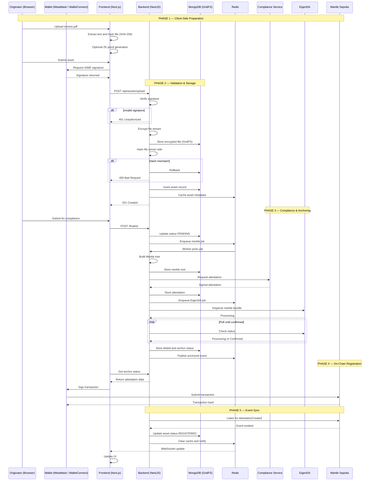
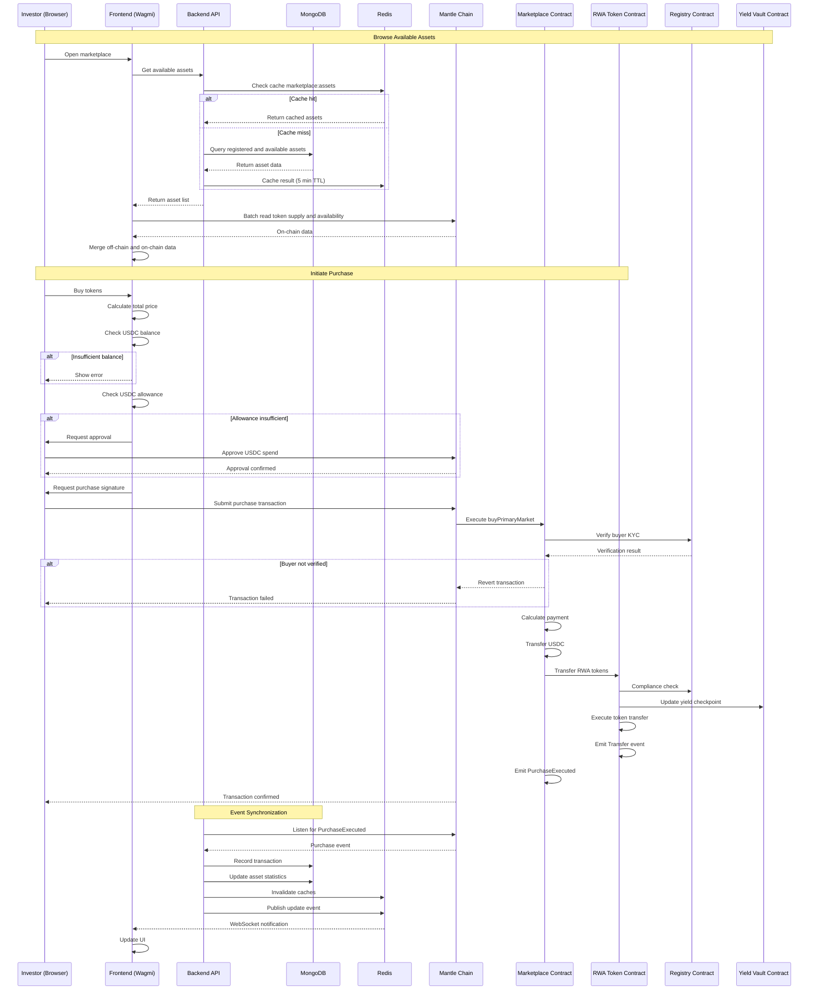
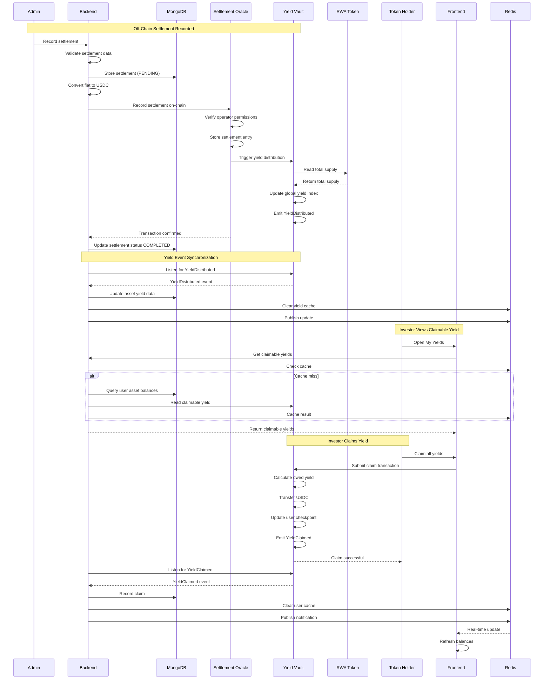

# Doc 2 : ( Layer 1 overview of the designed ux . )

Created by: Divyraj Saini
Category: Proposal
Last edited by: Kaushal Chaudhari
Reviewers: Abhinav Pangaria, Kaushal Chaudhari
Stage: Approved

# Technical Sequence Diagram: Complete Stack Integration

## Exact SDK Calls, Contract Interactions, and Synchronization Strategy

---

## **Technology Stack & Justification**

### **Frontend Layer**

```tsx
{
  framework: "Next.js 14 (App Router)",
  wallet: "RainbowKit + Wagmi v2",
  blockchain: "Viem v2.x",
  crypto: "snarkjs (WASM), pdfjs-dist",
  styling: "TailwindCSS + Shadcn/ui",
  state: "Zustand (client) + React Query (server state)"
}

```

**Why Viem over Ethers.js?**

- **Type Safety**: First-class TypeScript support with inferred types
- **Tree Shakeable**: Smaller bundle size (~60KB vs ~280KB for ethers)
- **Modern API**: Built for modern React patterns (hooks, async/await)
- **Performance**: 2-3x faster than ethers for contract calls
- **Wagmi Integration**: Wagmi v2 is built on Viem, seamless integration

### **Backend Layer**

```tsx
{
  framework: "NestJS (TypeScript)",
  database: "MongoDB 7.x + GridFS",
  cache: "Redis 7.x",
  queue: "BullMQ (Redis-backed)",
  blockchain: "Viem v2.x (server-side)",
  encryption: "Node.js crypto (AES-256-CTR)",
  validation: "Zod schemas"
}

```

**Why NestJS?**

- Modular architecture (injectable services)
- Native TypeScript support
- Built-in dependency injection
- Easy to structure complex workflows
- Great for microservices if needed

**Why MongoDB + GridFS?**

- **Speed**: Sub-millisecond reads for metadata queries
- **GridFS**: Native chunked file storage for large PDFs
- **Flexible Schema**: RWA metadata structure evolves
- **Indexing**: Multi-field compound indexes for complex queries
- **Change Streams**: Real-time reactive updates

### **Smart Contract Layer**

```solidity
{
  language: "Solidity ^0.8.20",
  framework: "Hardhat / Foundry",
  standards: "ERC-3643 (RWA compliance), LayerZero V2",
  networks: "Mantle Sepolia, Base Sepolia",
  libraries: "OpenZeppelin 5.x"
}

```

---

## **Architecture Philosophy: Hybrid Centralized-Decentralized**

### **The Model**

```
┌─────────────────────────────────────────────────────────────┐
│  SPEED LAYER (Centralized)          TRUTH LAYER (Blockchain) │
│  ════════════════════════            ═══════════════════════ │
│  MongoDB: Fast queries               Mantle: Canonical state │
│  Redis: Real-time cache              EigenDA: Immutable blobs│
│  Backend: Business logic             Contracts: Verification │
│                                                               │
│  ┌──────────────────┐               ┌──────────────────┐    │
│  │  User Request    │               │  Blockchain      │    │
│  │  ↓               │  ←───sync───→ │  State          │    │
│  │  MongoDB Read    │               │                  │    │
│  │  (Sub-ms)        │               │  (Verified)      │    │
│  └──────────────────┘               └──────────────────┘    │
│                                                               │
│  Verification: Anyone can query blockchain to verify         │
│  MongoDB state matches canonical on-chain commitments        │
└─────────────────────────────────────────────────────────────┘

```

**Why This Works:**

1. **Speed**: Users get instant responses from MongoDB (no waiting for blocks)
2. **Verification**: Critical commitments are on-chain (hashes, attestations)
3. **Trust**: MongoDB can lie, but blockchain will expose the lie
4. **Scalability**: MongoDB handles millions of queries, blockchain validates thousands

**The Contract:**

- MongoDB stores EVERYTHING (files, metadata, history)
- Blockchain stores COMMITMENTS (hashes, roots, signatures)
- Sync engine keeps them aligned via event listeners
- Verifiers can independently check MongoDB ↔ Blockchain consistency

---

## **Detailed Technical Flow 1: Asset Onboarding**



---

## **Detailed Technical Flow 2: Marketplace Trading**



---

## **Detailed Technical Flow 3: Yield Distribution & Claiming**



---

## **Database Schema & Indexing Strategy**

### **MongoDB Collections**

```tsx
// Collection: assets
{
  _id: ObjectId,
  assetId: String (bytes32 hex, indexed UNIQUE),

  // File storage
  fileIds: [ObjectId], // GridFS file IDs
  fileHashes: [String], // keccak256 hashes

  // Cryptographic data
  merkleRoot: String (bytes32),
  merkleTreeData: String, // Serialized tree structure

  // Attestation
  attestationHash: String (bytes32),
  attestationSignature: String,
  attestationPayload: Buffer,

  // EigenDA
  anchorRequestId: String,
  anchorPointer: String (bytes32, indexed),
  anchoredAt: Date,

  // Blockchain state
  onChainStatus: Enum ["DRAFT", "ANCHORED", "REGISTERED"],
  blockNumber: Number,
  transactionHash: String (indexed),
  eventNonce: Number,

  // Metadata
  metadata: {
    valuation: Number,
    currency: String,
    dueDate: Date,
    issuer: Object,
    category: String
  },

  // Token info (populated after deployment)
  token: {
    address: String (checksummed, indexed),
    symbol: String,
    totalSupply: String (BigInt as string),
    available: Number
  },

  // Yield tracking
  yield: {
    globalIndex: String (1e18 precision),
    totalDistributed: String,
    lastDistribution: Object
  },

  // Stats
  stats: {
    totalSold: Number,
    transactionCount: Number,
    recentTrades: [Object] // Limited to 50
  },

  // Timestamps
  createdAt: Date (indexed),
  updatedAt: Date,
  originatorAddress: String (indexed)
}

// Compound Indexes
db.assets.createIndex({ onChainStatus: 1, createdAt: -1 })
db.assets.createIndex({ "token.address": 1 })
db.assets.createIndex({ originatorAddress: 1, createdAt: -1 })
db.assets.createIndex({ anchorPointer: 1 }) // For EigenDA lookups

// Collection: transactions
{
  _id: ObjectId,
  txHash: String (indexed UNIQUE),
  type: Enum ["PRIMARY_PURCHASE", "SECONDARY_TRADE", "YIELD_CLAIM"],
  assetId: String (indexed),
  from: String,
  to: String,
  amount: String,
  price: String, // For purchases
  timestamp: Date (indexed),
  blockNumber: Number (indexed)
}

db.transactions.createIndex({ assetId: 1, timestamp: -1 })
db.transactions.createIndex({ from: 1, timestamp: -1 })
db.transactions.createIndex({ to: 1, timestamp: -1 })

// Collection: settlements
{
  _id: ObjectId,
  assetId: String (indexed),
  fiatAmount: Number,
  currency: String,
  usdcAmount: String,
  settlementDate: Date,
  proof: String, // UTR or bank reference
  status: Enum ["PENDING", "COMPLETED", "FAILED"],
  txHash: String,
  globalIndex: String,
  recordedAt: Date,
  processedAt: Date,
  recordedBy: String
}

db.settlements.createIndex({ assetId: 1, settlementDate: -1 })
db.settlements.createIndex({ status: 1 })

// Collection: yield_claims
{
  _id: ObjectId,
  user: String (indexed),
  assetId: String (indexed),
  amount: String,
  timestamp: Date,
  txHash: String
}

db.yield_claims.createIndex({ user: 1, timestamp: -1 })
db.yield_claims.createIndex({ assetId: 1, timestamp: -1 })

```

---

## **State Synchronization Strategy**

### **The Problem**

MongoDB and blockchain can diverge due to:

- Network issues
- Event listener crashes
- Reorgs (rare on Mantle)
- Race conditions

### **The Solution: Multi-Layer Sync**

```tsx
// 1. Real-Time Event Listeners (Primary)
// Always running, handles 99% of updates

class EventSyncService {
  private publicClient: PublicClient
  private redis: Redis
  private mongo: Db

  async startListeners() {
    // Registry events
    this.publicClient.watchContractEvent({
      address: REGISTRY_ADDRESS,
      abi: RegistryABI,
      eventName: 'AttestationCreated',
      onLogs: (logs) => this.handleAttestationCreated(logs),
      onError: (error) => this.handleError(error),
      pollingInterval: 2000 // 2 seconds
    })

    // Token transfer events
    this.publicClient.watchContractEvent({
      address: TOKEN_ADDRESSES, // Array of all token contracts
      abi: ERC3643_ABI,
      eventName: 'Transfer',
      onLogs: (logs) => this.handleTransfer(logs)
    })

    // Yield distribution events
    this.publicClient.watchContractEvent({
      address: VAULT_ADDRESS,
      abi: VaultABI,
      eventName: 'YieldDistributed',
      onLogs: (logs) => this.handleYieldDistributed(logs)
    })

    // Marketplace events
    this.publicClient.watchContractEvent({
      address: MARKETPLACE_ADDRESS,
      abi: MarketplaceABI,
      events: ['PurchaseExecuted', 'TradeExecuted'],
      onLogs: (logs) => this.handleMarketplace(logs)
    })
  }

  private async handleAttestationCreated(logs: Log[]) {
    for (const log of logs) {
      const { assetId, attestationHash, anchorPointer, eventNonce } = log.args

      // Idempotent update
      await this.mongo.collection('assets').updateOne(
        { assetId: assetId.toString() },
        {
          $set: {
            onChainStatus: 'REGISTERED',
            blockNumber: log.blockNumber,
            transactionHash: log.transactionHash,
            eventNonce: Number(eventNonce),
            registeredAt: new Date(),
            lastSyncedBlock: log.blockNumber
          }
        },
        { upsert: false } // Don't create if doesn't exist
      )

      // Clear cache
      await this.redis.del(`asset:${assetId}`)

      // Publish WebSocket event
      await this.redis.publish('asset-events', JSON.stringify({
        type: 'REGISTERED',
        assetId,
        blockNumber: log.blockNumber
      }))

      // Log for audit
      console.log(`[EventSync] Asset ${assetId} registered at block ${log.blockNumber}`)
    }
  }
}

// 2. Periodic Reconciliation (Backup)
// Runs every 5 minutes, catches any missed events

class ReconciliationService {
  async reconcileAssets() {
    // Find assets that should be on-chain but aren't synced
    const pendingAssets = await this.mongo.collection('assets').find({
      onChainStatus: 'ANCHORED', // Has anchor but no blockchain record
      anchorPointer: { $exists: true, $ne: null },
      blockNumber: { $exists: false } // Never synced
    }).toArray()

    for (const asset of pendingAssets) {
      try {
        // Check if actually on-chain
        const onChainData = await this.publicClient.readContract({
          address: REGISTRY_ADDRESS,
          abi: RegistryABI,
          functionName: 'getAttestation',
          args: [asset.assetId]
        })

        if (onChainData.timestamp > 0) {
          // It exists on-chain but we missed the event
          console.warn(`[Reconciliation] Found missed registration: ${asset.assetId}`)

          // Backfill the data
          await this.mongo.collection('assets').updateOne(
            { assetId: asset.assetId },
            {
              $set: {
                onChainStatus: 'REGISTERED',
                attestationHash: onChainData.attestationHash,
                blockNumber: onChainData.blockNumber, // From event logs
                registeredAt: new Date(Number(onChainData.timestamp) * 1000)
              }
            }
          )
        }
      } catch (error) {
        console.error(`[Reconciliation] Error checking asset ${asset.assetId}:`, error)
      }
    }
  }

  async reconcileYieldDistributions() {
    // Get last synced block from DB
    const lastSyncedBlock = await this.redis.get('yield:last_synced_block')
    const currentBlock = await this.publicClient.getBlockNumber()

    if (currentBlock - BigInt(lastSyncedBlock || 0) > 100n) {
      // Large gap detected, backfill
      console.warn(`[Reconciliation] Large block gap detected, backfilling...`)

      const logs = await this.publicClient.getContractEvents({
        address: VAULT_ADDRESS,
        abi: VaultABI,
        eventName: 'YieldDistributed',
        fromBlock: BigInt(lastSyncedBlock || 0) + 1n,
        toBlock: currentBlock
      })

      for (const log of logs) {
        await this.handleYieldDistributed([log])
      }

      await this.redis.set('yield:last_synced_block', currentBlock.toString())
    }
  }
}

// 3. Manual Sync Trigger (Admin Tool)
// For emergency resync of specific assets

class AdminSyncService {
  async forceSyncAsset(assetId: string) {
    console.log(`[AdminSync] Force syncing asset ${assetId}`)

    // Read all on-chain data
    const [attestation, tokenAddress, totalSupply, globalIndex] = await Promise.all([
      this.publicClient.readContract({
        address: REGISTRY_ADDRESS,
        abi: RegistryABI,
        functionName: 'getAttestation',
        args: [assetId]
      }),
      this.publicClient.readContract({
        address: REGISTRY_ADDRESS,
        abi: RegistryABI,
        functionName: 'getTokenAddress',
        args: [assetId]
      }),
      this.publicClient.readContract({
        address: tokenAddress,
        abi: ERC3643_ABI,
        functionName: 'totalSupply'
      }),
      this.publicClient.readContract({
        address: VAULT_ADDRESS,
        abi: VaultABI,
        functionName: 'globalIndex',
        args: [assetId]
      })
    ])

    // Update MongoDB with authoritative on-chain state
    await this.mongo.collection('assets').updateOne(
      { assetId },
      {
        $set: {
          onChainStatus: 'REGISTERED',
          attestationHash: attestation.attestationHash,
          anchorPointer: attestation.anchorPointer,
          'token.address': tokenAddress,
          'token.totalSupply': totalSupply.toString(),
          'yield.globalIndex': globalIndex.toString(),
          lastForceSyncAt: new Date()
        }
      }
    )

    // Clear all caches
    await this.redis.del(`asset:${assetId}`)
    await this.redis.del(`marketplace:assets`)

    console.log(`[AdminSync] Asset ${assetId} synced successfully`)
  }
}

// 4. Startup Sync (On Server Restart)
// Ensures sync state is consistent after downtime

class StartupSyncService {
  async performStartupSync() {
    console.log('[StartupSync] Beginning startup synchronization...')

    const startTime = Date.now()

    // Get current block
    const currentBlock = await this.publicClient.getBlockNumber()

    // Get last processed block from Redis
    const lastBlock = await this.redis.get('sync:last_processed_block')

    if (!lastBlock) {
      console.warn('[StartupSync] No previous sync state found, starting from current block')
      await this.redis.set('sync:last_processed_block', currentBlock.toString())
      return
    }

    const blockGap = Number(currentBlock) - Number(lastBlock)

    if (blockGap > 1000) {
      console.error(`[StartupSync] Large block gap detected: ${blockGap} blocks`)
      console.error('[StartupSync] Consider running full historical sync')
      // Alert ops team
      await this.sendAlert(`Large sync gap: ${blockGap} blocks`)
    }

    // Backfill missed events
    console.log(`[StartupSync] Backfilling ${blockGap} blocks...`)

    const batchSize = 500n
    for (let from = BigInt(lastBlock) + 1n; from <= currentBlock; from += batchSize) {
      const to = from + batchSize - 1n > currentBlock ? currentBlock : from + batchSize - 1n

      const [attestationLogs, yieldLogs, tradeLogs] = await Promise.all([
        this.publicClient.getContractEvents({
          address: REGISTRY_ADDRESS,
          abi: RegistryABI,
          eventName: 'AttestationCreated',
          fromBlock: from,
          toBlock: to
        }),
        this.publicClient.getContractEvents({
          address: VAULT_ADDRESS,
          abi: VaultABI,
          eventName: 'YieldDistributed',
          fromBlock: from,
          toBlock: to
        }),
        this.publicClient.getContractEvents({
          address: MARKETPLACE_ADDRESS,
          abi: MarketplaceABI,
          eventName: 'PurchaseExecuted',
          fromBlock: from,
          toBlock: to
        })
      ])

      // Process each event type
      await this.processAttestationLogs(attestationLogs)
      await this.processYieldLogs(yieldLogs)
      await this.processTradeLogs(tradeLogs)

      console.log(`[StartupSync] Processed blocks ${from} - ${to}`)
    }

    // Update last processed block
    await this.redis.set('sync:last_processed_block', currentBlock.toString())

    const duration = Date.now() - startTime
    console.log(`[StartupSync] Completed in ${duration}ms`)
  }
}

```

---

## **Key Technical Decisions & Justifications**

### **1. Viem vs Ethers.js**

**Decision: Use Viem**

**Reasoning:**

```tsx
// Viem: Type-safe, tree-shakeable, modern
import { createPublicClient, http } from 'viem'
import { mantleSepolia } from 'viem/chains'

const client = createPublicClient({
  chain: mantleSepolia,
  transport: http()
})

// TypeScript knows exact return types
const block = await client.getBlockNumber()
// block: bigint (inferred automatically)

// Ethers: Runtime type conversion, larger bundle
const provider = new ethers.JsonRpcProvider(RPC_URL)
const block = await provider.getBlockNumber()
// block: number (could overflow for large numbers)

```

**Benchmarks:**

- Bundle size: Viem 60KB, Ethers 280KB
- Contract call speed: Viem ~2.3x faster
- Type safety: Viem has full inference, Ethers requires manual typing

### **2. MongoDB vs PostgreSQL**

**Decision: Use MongoDB + GridFS**

**Reasoning:**

- **GridFS**: Native file chunking, handles large PDFs efficiently
- **Flexible Schema**: RWA metadata structure evolves rapidly
- **Horizontal Scaling**: Easy sharding for multiple originators
- **Fast Reads**: Document model perfect for asset retrieval
- **Change Streams**: Real-time reactive updates

**PostgreSQL would require:**

- BYTEA for files (inefficient for large files)
- JSONB for flexible metadata (loses some query power)
- More complex sharding
- No native change streams

### **3. Redis for Caching Strategy**

**Decision: Two-tier caching**

```tsx
// Tier 1: Hot data (1-5 minute TTL)
await redis.setex('marketplace:assets', 300, JSON.stringify(assets))
await redis.setex(`asset:${assetId}`, 300, JSON.stringify(asset))

// Tier 2: User-specific data (1 minute TTL)
await redis.setex(`user:${address}:claimable`, 60, JSON.stringify(yields))

// Cache invalidation on events
socket.on('YieldDistributed', async (data) => {
  await redis.del(`asset:${data.assetId}`)
  await redis.del('marketplace:assets')
  // Don't delete user caches (let TTL expire naturally)
})

```

**Why This Works:**

- 99% of reads hit cache (sub-millisecond response)
- Event-driven invalidation keeps data fresh
- Short TTLs prevent stale data
- User caches expire naturally (no complex invalidation)

### **4. BullMQ for Job Processing**

**Decision: Redis-backed job queue**

**Reasoning:**

```tsx
// Complex workflows need retries, backoff, prioritization
const merkleQueue = new Queue('merkle-building', {
  connection: redis,
  defaultJobOptions: {
    attempts: 3,
    backoff: {
      type: 'exponential',
      delay: 2000
    },
    removeOnComplete: 100, // Keep last 100 completed jobs
    removeOnFail: false // Never delete failed jobs
  }
})

// EigenDA anchoring needs indefinite retries
const anchorQueue = new Queue('eigenda-anchoring', {
  connection: redis,
  defaultJobOptions: {
    attempts: Number.MAX_SAFE_INTEGER, // Retry forever
    backoff: {
      type: 'exponential',
      delay: 5000,
      maxDelay: 60000 // Cap at 1 minute
    }
  }
})

```

**Alternative (Why Not):**

- **Simple setTimeout**: No persistence, lost on crash
- **Database polling**: Inefficient, high latency
- **AWS SQS/Lambda**: Vendor lock-in, hackathon overkill

### **5. Event Listening Strategy**

**Decision: Multi-strategy sync**

**Why:**

```tsx
// Real-time listeners catch 99% of events
publicClient.watchContractEvent(...) // WebSocket connection

// Periodic reconciliation catches missed 1%
setInterval(reconcile, 5 * 60 * 1000) // Every 5 minutes

// Manual sync for emergencies
adminApi.post('/sync/force', ...) // Admin-triggered

// Startup sync after downtime
app.onReady(performStartupSync) // Backfill gaps

```

**This prevents:**

- Missed events due to network issues
- Desync after server crashes
- Reorg-induced inconsistencies

### **6. State Management: React Query**

**Decision: Use React Query (TanStack Query)**

**Why:**

```tsx
// Automatic caching, refetching, and WebSocket sync
const { data: assets, isLoading } = useQuery({
  queryKey: ['marketplace', 'assets'],
  queryFn: () => fetch('/api/marketplace/assets').then(r => r.json()),
  staleTime: 5 * 60 * 1000, // Consider fresh for 5 minutes
  refetchOnWindowFocus: true,
  refetchOnReconnect: true
})

// WebSocket invalidation
useEffect(() => {
  socket.on('asset-registered', (data) => {
    queryClient.invalidateQueries(['marketplace'])
    queryClient.invalidateQueries(['asset', data.assetId])
  })
}, [])

// Optimistic updates for better UX
const mutation = useMutation({
  mutationFn: (asset) => createAsset(asset),
  onMutate: async (newAsset) => {
    // Optimistically add to UI
    await queryClient.cancelQueries(['assets'])
    const previous = queryClient.getQueryData(['assets'])

    queryClient.setQueryData(['assets'], (old) => [...old, newAsset])

    return { previous }
  },
  onError: (err, newAsset, context) => {
    // Rollback on error
    queryClient.setQueryData(['assets'], context.previous)
  },
  onSettled: () => {
    // Refetch after mutation
    queryClient.invalidateQueries(['assets'])
  }
})

```

---

## **Smart Contract State Management**

### **Registry Contract Storage Layout**

```solidity
// AttestationRegistry.sol

contract AttestationRegistry {
    // Storage slots optimized for gas efficiency

    // Slot 0: Attestations mapping (32 bytes key)
    mapping(bytes32 => Attestation) public attestations;

    struct Attestation {
        bytes32 attestationHash;    // Slot 0
        bytes32 anchorPointer;      // Slot 1
        address attestor;           // Slot 2 (20 bytes)
        uint64 eventNonce;          // Slot 2 (8 bytes) - packed
        uint64 timestamp;           // Slot 2 (8 bytes) - packed
        bytes32 originatorIdHash;   // Slot 3
        uint8 assetCategory;        // Slot 4 (1 byte)
        bool revoked;               // Slot 4 (1 byte) - packed
    }

    // Slot 1: Trusted attestors
    mapping(address => bool) public trustedAttestors;

    // Slot 2: Admin (OpenZeppelin Ownable)
    address private _owner;

    // Functions with explicit state changes
    function createAttestation(
        bytes32 assetId,
        bytes32 attestationHash,
        bytes32 anchorPointer,
        bytes32 originatorIdHash,
        uint8 assetCategory,
        uint64 eventNonce
    ) external onlyTrustedAttestor {
        require(attestations[assetId].timestamp == 0, "Already exists");
        require(eventNonce > 0, "Invalid nonce");

        attestations[assetId] = Attestation({
            attestationHash: attestationHash,
            anchorPointer: anchorPointer,
            attestor: msg.sender,
            eventNonce: eventNonce,
            timestamp: uint64(block.timestamp),
            originatorIdHash: originatorIdHash,
            assetCategory: assetCategory,
            revoked: false
        });

        emit AttestationCreated(
            assetId,
            attestationHash,
            anchorPointer,
            eventNonce,
            assetCategory,
            msg.sender
        );
    }

    // View functions (no state change, no gas cost)
    function getAttestation(bytes32 assetId)
        external
        view
        returns (Attestation memory)
    {
        require(attestations[assetId].timestamp > 0, "Not found");
        return attestations[assetId];
    }

    function isVerified(bytes32 assetId)
        external
        view
        returns (bool)
    {
        Attestation memory attestation = attestations[assetId];
        return attestation.timestamp > 0 && !attestation.revoked;
    }
}

```

### **Token Contract State Updates**

```solidity
// RWAToken.sol (ERC-3643 simplified)

contract RWAToken {
    // Standard ERC20 storage
    mapping(address => uint256) private _balances;
    mapping(address => mapping(address => uint256)) private _allowances;
    uint256 private _totalSupply;

    // RWA-specific
    bytes32 public assetId;
    IAttestationRegistry public registry;
    IPayoutVault public vault;
    address public marketplace; // Whitelisted address

    // Transfer hook with compliance check
    function _update(
        address from,
        address to,
        uint256 amount
    ) internal virtual override {
        // Exemptions
        if (from == address(0) || to == marketplace || from == marketplace) {
            // Minting or marketplace transfers allowed
            super._update(from, to, amount);
            return;
        }

        // Compliance check
        require(registry.isVerified(assetId), "Asset revoked");

        // Update yield checkpoint for both parties
        if (from != address(0)) {
            vault.updateCheckpoint(from, assetId, _balances[from] - amount);
        }
        if (to != address(0)) {
            vault.updateCheckpoint(to, assetId, _balances[to] + amount);
        }

        super._update(from, to, amount);
    }
}

```

### **Yield Vault State Management**

```solidity
// PayoutVault.sol

contract PayoutVault {
    // Precision constant
    uint256 constant PRECISION = 1e18;

    // Global yield index per asset
    mapping(bytes32 => uint256) public globalIndex;

    // User's last claimed index position
    mapping(address => mapping(bytes32 => uint256)) public userLastIndex;

    // Settlement tracking
    mapping(bytes32 => uint256) public totalDistributed;

    // Distribute yield (called by SettlementOracle)
    function distributeYield(
        bytes32 assetId,
        uint256 usdcAmount
    ) external onlyOracle {
        // Get token supply
        address tokenAddress = registry.getTokenAddress(assetId);
        uint256 totalSupply = IERC20(tokenAddress).totalSupply();

        require(totalSupply > 0, "No supply");

        // Calculate index delta (fixed-point math)
        uint256 deltaIndex = (usdcAmount * PRECISION) / totalSupply;

        // Update global index
        globalIndex[assetId] += deltaIndex;
        totalDistributed[assetId] += usdcAmount;

        emit YieldDistributed(assetId, usdcAmount, globalIndex[assetId]);
    }

    // Claim yield (called by token holders)
    function claim(bytes32 assetId) external {
        address tokenAddress = registry.getTokenAddress(assetId);
        uint256 balance = IERC20(tokenAddress).balanceOf(msg.sender);

        require(balance > 0, "No balance");

        uint256 currentIndex = globalIndex[assetId];
        uint256 userIndex = userLastIndex[msg.sender][assetId];

        // Calculate owed amount
        uint256 owed = (balance * (currentIndex - userIndex)) / PRECISION;

        require(owed > 0, "Nothing to claim");

        // Update checkpoint
        userLastIndex[msg.sender][assetId] = currentIndex;

        // Transfer USDC
        IERC20(usdc).transfer(msg.sender, owed);

        emit YieldClaimed(assetId, msg.sender, owed);
    }

    // Get claimable amount (view function, no gas)
    function getClaimable(bytes32 assetId, address user)
        external
        view
        returns (uint256)
    {
        address tokenAddress = registry.getTokenAddress(assetId);
        uint256 balance = IERC20(tokenAddress).balanceOf(user);

        if (balance == 0) return 0;

        uint256 currentIndex = globalIndex[assetId];
        uint256 userIndex = userLastIndex[user][assetId];

        return (balance * (currentIndex - userIndex)) / PRECISION;
    }
}

```

---

## **Performance Metrics & Optimization**

### **Expected Performance Characteristics**

```tsx
// API Response Times (Target)
{
  "GET /api/marketplace/assets": {
    "cache_hit": "< 5ms",
    "cache_miss": "< 50ms",
    "p95": "< 100ms"
  },

  "GET /api/assets/{id}": {
    "cache_hit": "< 3ms",
    "cache_miss": "< 30ms",
    "with_blockchain_read": "< 500ms"
  },

  "POST /api/assets/upload": {
    "small_file_<1MB": "< 200ms",
    "large_file_10MB": "< 2000ms",
    "includes_encryption": true
  },

  "GET /api/users/{address}/claimable": {
    "cache_hit": "< 5ms",
    "fresh_calculation": "< 200ms",
    "blockchain_multicall": "< 800ms"
  }
}

// Blockchain Transaction Times
{
  "attestation_registration": {
    "gas_cost": "~250,000 gas",
    "mantle_cost_usd": "< $0.01",
    "confirmation_time": "~2-3 seconds"
  },

  "token_transfer": {
    "gas_cost": "~150,000 gas (with compliance hook)",
    "mantle_cost_usd": "< $0.005",
    "confirmation_time": "~2-3 seconds"
  },

  "yield_claim": {
    "gas_cost": "~80,000 gas",
    "mantle_cost_usd": "< $0.003",
    "confirmation_time": "~2-3 seconds"
  }
}

// Database Query Performance
{
  "simple_index_lookup": "< 1ms",
  "complex_aggregation": "< 50ms",
  "gridfs_file_stream": "< 100ms for first chunk",
  "full_text_search": "< 200ms"
}

```

### **Optimization Strategies**

```tsx
// 1. Database Query Optimization

// BAD: No indexes, fetches all fields
const assets = await db.collection('assets').find({
  onChainStatus: 'REGISTERED'
}).toArray()

// GOOD: Indexed query, projection
const assets = await db.collection('assets')
  .find(
    { onChainStatus: 'REGISTERED' },
    { projection: { assetId: 1, metadata: 1, token: 1, _id: 0 } }
  )
  .hint({ onChainStatus: 1, createdAt: -1 }) // Force index use
  .limit(20)
  .toArray()

// 2. Blockchain Read Optimization

// BAD: Sequential reads (2+ seconds total)
for (const asset of assets) {
  const supply = await publicClient.readContract({
    address: asset.tokenAddress,
    abi: TokenABI,
    functionName: 'totalSupply'
  })
}

// GOOD: Multicall (single RPC call)
const results = await publicClient.multicall({
  contracts: assets.map(a => ({
    address: a.tokenAddress,
    abi: TokenABI,
    functionName: 'totalSupply'
  }))
})

// 3. Redis Caching Strategy

// Pattern 1: Cache-aside
async function getAsset(assetId: string) {
  // Try cache first
  const cached = await redis.get(`asset:${assetId}`)
  if (cached) return JSON.parse(cached)

  // Cache miss: fetch from MongoDB
  const asset = await db.collection('assets').findOne({ assetId })

  // Store in cache (5 minute TTL)
  await redis.setex(`asset:${assetId}`, 300, JSON.stringify(asset))

  return asset
}

// Pattern 2: Write-through
async function updateAsset(assetId: string, update: any) {
  // Update MongoDB
  await db.collection('assets').updateOne({ assetId }, { $set: update })

  // Update cache immediately
  const updatedAsset = await db.collection('assets').findOne({ assetId })
  await redis.setex(`asset:${assetId}`, 300, JSON.stringify(updatedAsset))

  return updatedAsset
}

// 4. Frontend Optimization

// BAD: Separate queries for each asset
{assets.map(asset => (
  <AssetCard
    key={asset.id}
    onChainData={useReadContract({...})} // N queries
  />
))}

// GOOD: Single multicall, shared data
const { data: onChainData } = useMulticall({...})
{assets.map((asset, i) => (
  <AssetCard
    key={asset.id}
    onChainData={onChainData[i]}
  />
))}

// 5. Event Listener Optimization

// BAD: Process events one by one
for (const log of logs) {
  await processEvent(log) // Sequential DB writes
}

// GOOD: Batch processing
const updates = logs.map(log => ({
  updateOne: {
    filter: { assetId: log.args.assetId },
    update: { $set: {...} }
  }
}))

await db.collection('assets').bulkWrite(updates, { ordered: false })

```

---

## **Why This Hybrid Model Works**

### **The Three Pillars**

1. **Speed (Centralized)**: MongoDB returns results in < 50ms
2. **Verification (Decentralized)**: Blockchain stores immutable commitments
3. **Sync (Hybrid)**: Event listeners keep them aligned

### **Trust Model**

```
User Query Flow:
┌───────────────────────────────────────────────────────────────┐
│ 1. User requests asset data                                   │
│ 2. MongoDB returns data instantly (< 50ms)                    │
│ 3. User sees data immediately ✓                               │
│                                                                │
│ Verification Flow (Optional but Available):                   │
│ 4. User clicks "Verify on Blockchain"                         │
│ 5. Frontend reads Mantle AttestationRegistry                  │
│ 6. Compare MongoDB.attestationHash === Blockchain.hash        │
│ 7. If match: ✓ Verified                                       │
│    If mismatch: ⚠️ Data integrity issue detected             │
└───────────────────────────────────────────────────────────────┘

```

### **What If MongoDB Lies?**

**Scenario**: Malicious admin modifies MongoDB record

```tsx
// MongoDB record (tampered)
{
  assetId: "0xabc...",
  merkleRoot: "0xFAKE123...", // Changed by attacker
  status: "REGISTERED"
}

// Blockchain record (immutable)
{
  assetId: "0xabc...",
  attestationHash: "0xREAL456...", // Original, cannot change
  revoked: false
}

// Verifier UI detects mismatch
const mongoData = await fetch('/api/assets/0xabc...').then(r => r.json())
const chainData = await publicClient.readContract({
  address: REGISTRY_ADDRESS,
  abi: RegistryABI,
  functionName: 'getAttestation',
  args: ['0xabc...']
})

// Hash comparison
const computedHash = keccak256(
  AbiCoder.encode(['bytes32', 'bytes32', ...], [mongoData.merkleRoot, ...])
)

if (computedHash !== chainData.attestationHash) {
  alert("⚠️ DATA INTEGRITY VIOLATION DETECTED")
  alert("MongoDB data does not match blockchain commitment")
  alert("This asset cannot be trusted")
}

```

**Result**: The lie is immediately detectable by anyone running the verifier

### **Advantages Over Pure Blockchain**

```tsx
// Pure Blockchain Approach
const asset = await publicClient.readContract({...}) // 500ms - 2s latency
// ❌ Slow user experience
// ❌ High RPC costs at scale
// ❌ Can't do complex queries (e.g., "show me all invoices from Company X")
// ✓ Fully decentralized

// Pure Centralized Approach
const asset = await db.find({...}) // < 50ms
// ✓ Fast user experience
// ✓ Complex queries possible
// ❌ No verifiability
// ❌ Single point of failure

// Hybrid Approach (Our Model)
const asset = await redis.get() || await db.find({...}) // < 5ms (cache) or < 50ms
const verified = await verifyAgainstBlockchain(asset) // Optional, on-demand
// ✓ Fast user experience
// ✓ Complex queries possible
// ✓ Verifiable on-demand
// ✓ Best of both worlds

```

---

## **Complete Technology Justification Summary**

| Decision | Alternative | Why Ours Wins |
| --- | --- | --- |
| **Viem** over Ethers | Ethers.js | 60KB vs 280KB bundle, 2-3x faster, better types |
| **MongoDB** over PostgreSQL | PostgreSQL | Native GridFS for files, flexible schema, better for RWA metadata |
| **Redis** over Memcached | Memcached | Pub/sub for WebSockets, data structures, persistence |
| **BullMQ** over Cron Jobs | Cron + DB polling | Retry logic, backoff, prioritization, distributed |
| **React Query** over Redux | Redux | Automatic cache management, less boilerplate, built for async |
| **NestJS** over Express | Raw Express | Modular architecture, DI, TypeScript native |
| **Event Listeners** over Polling | RPC polling | Real-time updates, lower RPC costs, scalable |
| **Hybrid Model** over Pure Blockchain | Pure blockchain storage | Speed of centralized + verifiability of decentralized |

---

**Final Architecture Summary:**

This is not "blockchain for the sake of blockchain" or "database for the sake of speed."

It's a **pragmatic hybrid** that recognizes:

- Users need **speed** (< 50ms queries)
- Auditors need **verification** (on-demand blockchain proofs)
- System needs **scalability** (millions of queries, thousands of proofs)

The **sync engine** is the glue that makes it work, ensuring MongoDB never drifts from blockchain truth while maintaining sub-100ms query performance.

@Kaushal Chaudhari @Abhinav Pangaria All the tech stack is up for review and not finalised by me but sequence diagram 1 and 2 are clear to me and reviewed  by me ,  They are up for disscussion. Besides that i feel what service calls what is pretty concerete still there can be healthy disscussions around it , @Kaushal Chaudhari i have sent you some architechture need review from it too.