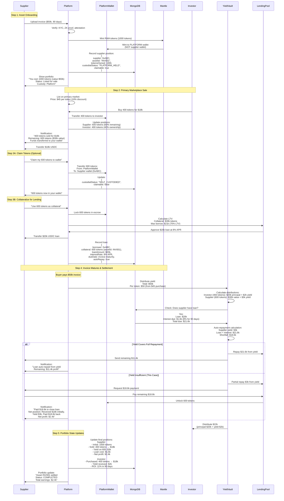
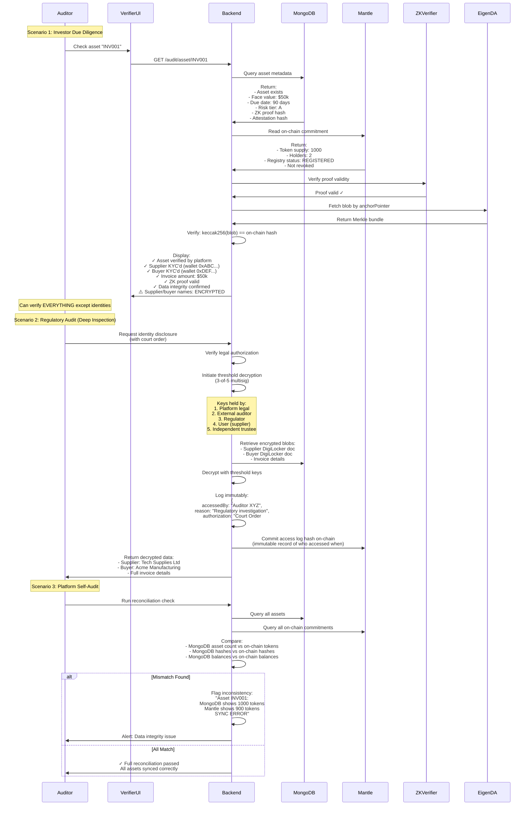
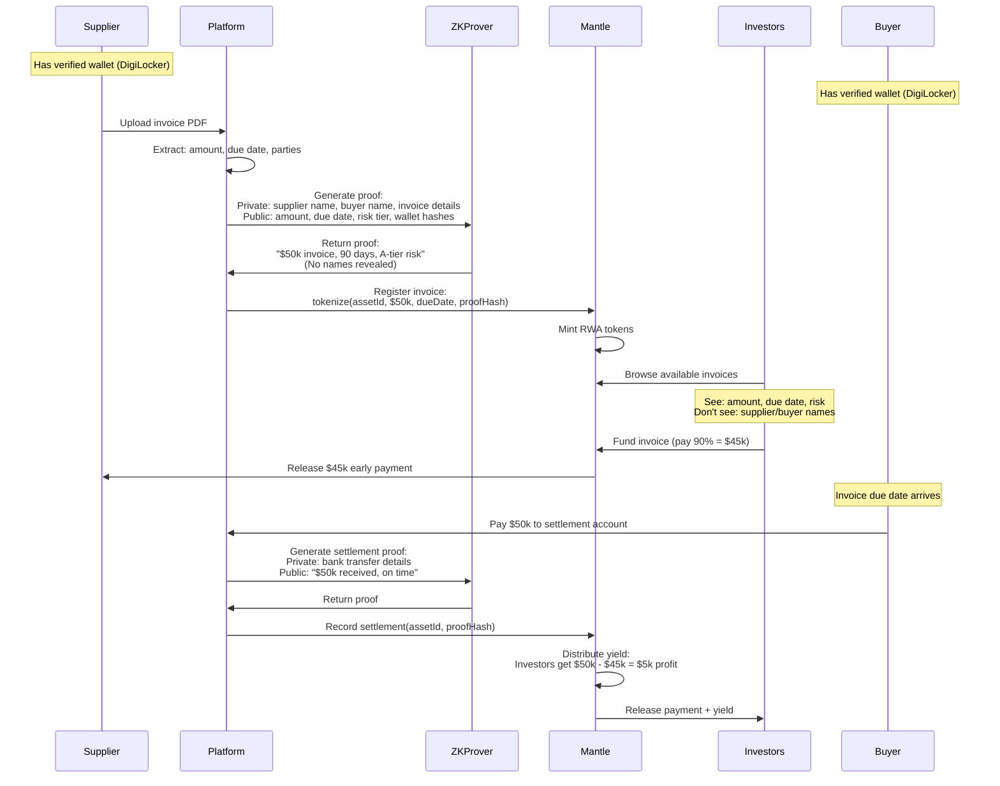

# Doc 3 : (ZK)

Created by: Divyraj Saini
Category: Proposal
Last edited by: Abhinav Pangaria
Reviewers: Abhinav Pangaria, Kaushal Chaudhari
Stage: Approved
Text: Have a look and review the flow

@Abhinav Pangaria Have a look this seems good to me.

@Abhinav Pangaria Audit looks like

@Abhinav Pangaria zk proofing 

