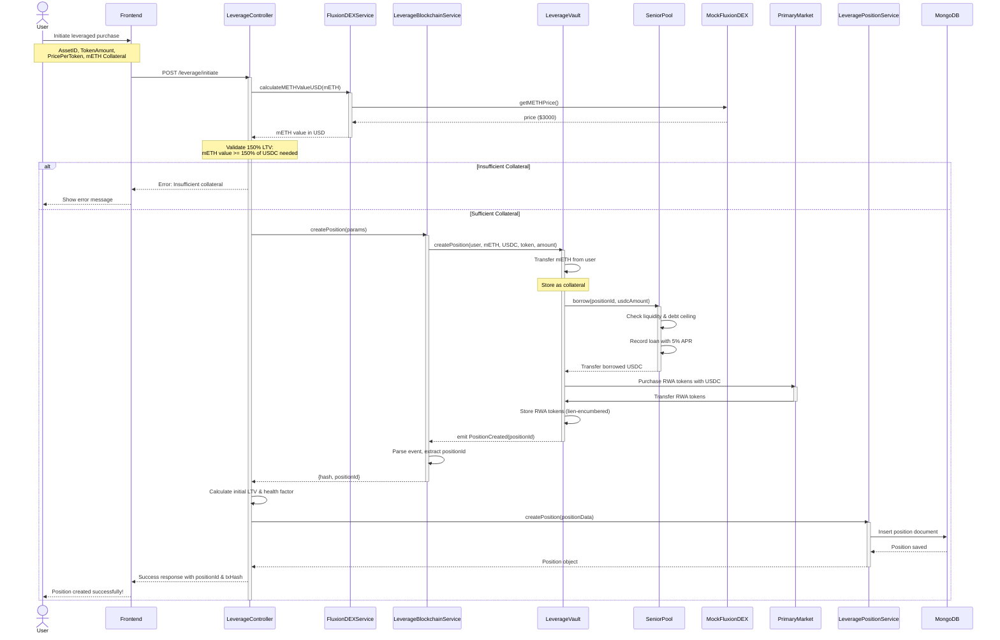

# RWA Platform - System Flow Diagrams

This document contains sequence diagrams illustrating all major flows in the RWA platform.

## Table of Contents
1. [Leveraged mETH Purchase Flow](#1-leveraged-meth-purchase-flow)
2. [Automated Harvest Flow](#2-automated-harvest-flow)
3. [Health Monitoring & Liquidation Flow](#3-health-monitoring--liquidation-flow)
4. [Settlement Waterfall Flow](#4-settlement-waterfall-flow)
5. [Auction Clearing Price Suggestion Flow](#5-auction-clearing-price-suggestion-flow)
6. [Asset Lifecycle Flow](#6-asset-lifecycle-flow)

---

## 1. Leveraged mETH Purchase Flow

**Key Points**:
- 150% LTV validation happens before blockchain transaction
- mETH transferred to LeverageVault as collateral
- SeniorPool lends USDC with 5% APR
- RWA tokens purchased and held by vault (not directly by user)
- Position tracked in MongoDB with health metrics

---

## 2. Automated Harvest Flow

```mermaid
sequenceDiagram
    participant Cron
    participant HarvestKeeperService
    participant LeveragePositionService
    participant MongoDB
    participant LeverageBlockchainService
    participant FluxionDEXService
    participant LeverageVault
    participant MockMETH
    participant FluxionIntegration
    participant MockFluxionDEX
    participant SeniorPool
    participant NotificationService

    Note over Cron: Every 4 minutes in demo mode<br/>(24 hours in production)

    Cron->>HarvestKeeperService: Execute harvest job
    activate HarvestKeeperService

    HarvestKeeperService->>LeveragePositionService: getActivePositions()
    activate LeveragePositionService
    LeveragePositionService->>MongoDB: Find positions where status=ACTIVE
    MongoDB-->>LeveragePositionService: Active positions array
    LeveragePositionService-->>HarvestKeeperService: positions[]
    deactivate LeveragePositionService

    loop For each active position
        HarvestKeeperService->>LeverageBlockchainService: getAccruedInterest(positionId)
        activate LeverageBlockchainService
        LeverageBlockchainService->>SeniorPool: getAccruedInterest(positionId)
        activate SeniorPool
        SeniorPool->>SeniorPool: Calculate interest (principal × APR × time × multiplier)
        Note over SeniorPool: Demo mode: 360x multiplier
        SeniorPool-->>LeverageBlockchainService: accruedInterest
        deactivate SeniorPool
        LeverageBlockchainService-->>HarvestKeeperService: interestAmount
        deactivate LeverageBlockchainService

        alt Interest > 0
            HarvestKeeperService->>FluxionDEXService: calculateMETHForUSDC(interestAmount + 5% buffer)
            activate FluxionDEXService
            FluxionDEXService->>MockFluxionDEX: getQuote(targetUSDC)
            MockFluxionDEX-->>FluxionDEXService: mETH needed
            FluxionDEXService-->>HarvestKeeperService: mETH amount (with buffer)
            deactivate FluxionDEXService

            HarvestKeeperService->>FluxionDEXService: checkLiquidity(mETH × 10)
            activate FluxionDEXService
            FluxionDEXService->>MockFluxionDEX: Check reserves
            MockFluxionDEX-->>FluxionDEXService: hasLiquidity = true/false
            FluxionDEXService-->>HarvestKeeperService: liquidity status
            deactivate FluxionDEXService

            alt Sufficient Liquidity
                HarvestKeeperService->>LeverageBlockchainService: harvestYield(positionId)
                activate LeverageBlockchainService

                LeverageBlockchainService->>LeverageVault: harvestYield(positionId)
                activate LeverageVault

                LeverageVault->>LeverageVault: Get position mETH appreciation
                LeverageVault->>MockMETH: getValueInUSD(mETH change)
                MockMETH-->>LeverageVault: USD value of appreciation

                LeverageVault->>FluxionIntegration: swapMETHToUSDC(mETHAmount)
                activate FluxionIntegration
                FluxionIntegration->>MockFluxionDEX: swapMETHForUSDC(amount, minOut)
                activate MockFluxionDEX
                MockFluxionDEX->>MockFluxionDEX: Validate slippage (max 3%)
                MockFluxionDEX->>MockFluxionDEX: Transfer mETH, send USDC
                MockFluxionDEX-->>FluxionIntegration: USDC received
                deactivate MockFluxionDEX
                FluxionIntegration-->>LeverageVault: USDC amount
                deactivate FluxionIntegration

                LeverageVault->>SeniorPool: repay(positionId, usdcAmount)
                activate SeniorPool
                SeniorPool->>SeniorPool: Split payment: principal vs interest
                SeniorPool->>SeniorPool: Update loan record
                SeniorPool-->>LeverageVault: (principalPaid, interestPaid)
                deactivate SeniorPool

                LeverageVault-->>LeverageBlockchainService: emit YieldHarvested(...)
                deactivate LeverageVault

                LeverageBlockchainService-->>HarvestKeeperService: Transaction hash
                deactivate LeverageBlockchainService

                HarvestKeeperService->>LeveragePositionService: recordHarvest(positionId, harvestData)
                activate LeveragePositionService
                LeveragePositionService->>MongoDB: Push to harvestHistory array
                LeveragePositionService->>MongoDB: Update totalInterestPaid, totalMETHHarvested
                MongoDB-->>LeveragePositionService: Updated
                LeveragePositionService-->>HarvestKeeperService: Success
                deactivate LeveragePositionService

                HarvestKeeperService->>NotificationService: create(LEVERAGE_HARVEST notification)
                NotificationService-->>HarvestKeeperService: Notification sent

            else Insufficient Liquidity
                HarvestKeeperService->>HarvestKeeperService: Log warning, skip this cycle
            end
        else Interest = 0
            HarvestKeeperService->>HarvestKeeperService: Skip harvest (no interest due)
        end
    end

    HarvestKeeperService-->>Cron: Harvest cycle complete
    deactivate HarvestKeeperService
```

**Key Points**:
- Runs every 4 minutes in demo mode (360x acceleration)
- Calculates accrued interest with time multiplier
- Only harvests if DEX has 10x liquidity buffer
- 5% slippage buffer added to mETH amount
- Tracks harvest history in MongoDB
- Sends notifications to users

---

## 3. Health Monitoring & Liquidation Flow

```mermaid
sequenceDiagram
    participant Cron
    participant HealthMonitorService
    participant LeveragePositionService
    participant LeverageBlockchainService
    participant MongoDB
    participant LeverageVault
    participant FluxionDEXService
    participant MockMETH
    participant SeniorPool
    participant NotificationService

    Note over Cron: Every 1 minute in demo mode<br/>(5 minutes in production)

    Cron->>HealthMonitorService: Execute health check job
    activate HealthMonitorService

    HealthMonitorService->>LeveragePositionService: getActivePositions()
    LeveragePositionService->>MongoDB: Find active positions
    MongoDB-->>LeveragePositionService: positions[]
    LeveragePositionService-->>HealthMonitorService: Active positions

    loop For each position
        HealthMonitorService->>LeverageBlockchainService: getHealthFactor(positionId)
        activate LeverageBlockchainService

        LeverageBlockchainService->>LeverageVault: getHealthFactor(positionId)
        activate LeverageVault
        LeverageVault->>LeverageVault: Get position mETH collateral & USDC debt

        LeverageVault->>FluxionDEXService: getMETHPrice()
        FluxionDEXService->>MockMETH: getPrice()
        MockMETH-->>FluxionDEXService: Current price
        FluxionDEXService-->>LeverageVault: mETH price

        LeverageVault->>LeverageVault: Calculate: (collateralValue × 10000) / debt
        Note over LeverageVault: Health Factor in basis points<br/>15000 = 150%, 11000 = 110%

        LeverageVault-->>LeverageBlockchainService: healthFactor
        deactivate LeverageVault
        LeverageBlockchainService-->>HealthMonitorService: Health factor value
        deactivate LeverageBlockchainService

        HealthMonitorService->>LeveragePositionService: updateHealth(positionId, healthFactor)
        activate LeveragePositionService
        LeveragePositionService->>LeveragePositionService: Determine health status
        Note over LeveragePositionService: HEALTHY (>140%)<br/>WARNING (125-140%)<br/>CRITICAL (110-125%)<br/>LIQUIDATABLE (<110%)
        LeveragePositionService->>MongoDB: Update currentHealthFactor & healthStatus
        MongoDB-->>LeveragePositionService: Updated
        LeveragePositionService-->>HealthMonitorService: Health status
        deactivate LeveragePositionService

        alt Health Factor < 110% (LIQUIDATABLE)
            Note over HealthMonitorService: 🚨 TRIGGER LIQUIDATION

            HealthMonitorService->>LeverageBlockchainService: liquidatePosition(positionId)
            activate LeverageBlockchainService

            LeverageBlockchainService->>LeverageVault: liquidatePosition(positionId)
            activate LeverageVault

            LeverageVault->>LeverageVault: Seize mETH collateral

            LeverageVault->>FluxionIntegration: swapMETHToUSDC(allCollateral)
            FluxionIntegration->>MockFluxionDEX: Swap mETH for USDC
            MockFluxionDEX-->>FluxionIntegration: USDC recovered
            FluxionIntegration-->>LeverageVault: usdcReceived

            LeverageVault->>LeverageVault: Get outstanding debt
            LeverageVault->>SeniorPool: repay(positionId, usdcReceived)
            activate SeniorPool
            SeniorPool->>SeniorPool: Apply payment to principal + interest
            SeniorPool->>SeniorPool: Close loan
            SeniorPool-->>LeverageVault: (repaidAmount, shortfall)
            deactivate SeniorPool

            alt Shortfall > 0
                Note over LeverageVault: Covered by JuniorTranche<br/>(first-loss capital)
            end

            LeverageVault->>LeverageVault: Mark position as liquidated
            LeverageVault-->>LeverageBlockchainService: emit PositionLiquidated(...)
            deactivate LeverageVault

            LeverageBlockchainService-->>HealthMonitorService: Liquidation tx hash
            deactivate LeverageBlockchainService

            HealthMonitorService->>LeveragePositionService: markLiquidated(positionId, details)
            activate LeveragePositionService
            LeveragePositionService->>MongoDB: Update status=LIQUIDATED, save liquidation data
            MongoDB-->>LeveragePositionService: Updated
            LeveragePositionService-->>HealthMonitorService: Success
            deactivate LeveragePositionService

            HealthMonitorService->>NotificationService: create(LEVERAGE_LIQUIDATION, severity=ERROR)
            NotificationService-->>HealthMonitorService: Notification sent to user

        else Health Factor 110-125% (CRITICAL)
            alt First critical alert OR 4 hours since last alert
                HealthMonitorService->>NotificationService: create(LEVERAGE_HEALTH_CRITICAL, severity=WARNING)
                NotificationService-->>HealthMonitorService: Notification sent
                HealthMonitorService->>LeveragePositionService: Update lastCriticalAlertAt timestamp
            end

        else Health Factor 125-140% (WARNING)
            alt First time in WARNING status
                HealthMonitorService->>NotificationService: create(LEVERAGE_HEALTH_WARNING, severity=INFO)
                NotificationService-->>HealthMonitorService: Notification sent once
            end

        else Health Factor > 140% (HEALTHY)
            Note over HealthMonitorService: No action needed
        end
    end

    HealthMonitorService-->>Cron: Health check cycle complete
    deactivate HealthMonitorService
```

**Key Points**:
- Runs every 1 minute in demo mode
- Calculates real-time health factor using current mETH price
- Progressive alerts: WARNING → CRITICAL → LIQUIDATION
- Automatic liquidation at <110% health factor
- Shortfalls covered by JuniorTranche (first-loss capital)
- Users notified at each threshold

---

## 4. Settlement Waterfall Flow

```mermaid
sequenceDiagram
    actor Admin
    participant YieldDistributionService
    participant YieldVault
    participant LeverageVault
    participant LeveragePositionService
    participant MongoDB
    participant SeniorPool
    participant NotificationService

    Note over Admin,YieldVault: Invoice settled, USDC received

    Admin->>YieldDistributionService: distributeYield(assetId)
    activate YieldDistributionService

    YieldDistributionService->>YieldVault: Get RWA token holders
    YieldVault-->>YieldDistributionService: holders[] (includes LeverageVault)

    alt LeverageVault holds tokens
        Note over YieldDistributionService: Detect leverage positions

        YieldDistributionService->>LeveragePositionService: Find positions for this asset
        activate LeveragePositionService
        LeveragePositionService->>MongoDB: Find by assetId & status=ACTIVE
        MongoDB-->>LeveragePositionService: leverage positions[]
        LeveragePositionService-->>YieldDistributionService: Positions with leverage
        deactivate LeveragePositionService

        loop For each leverage position
            YieldDistributionService->>YieldDistributionService: Calculate pro-rata share
            Note over YieldDistributionService: settlementUSDC = totalSettlement × (position.tokens / totalSupply)

            YieldDistributionService->>LeverageVault: processSettlement(positionId, settlementUSDC)
            activate LeverageVault

            Note over LeverageVault: 💧 WATERFALL DISTRIBUTION

            LeverageVault->>SeniorPool: getOutstandingDebt(positionId)
            activate SeniorPool
            SeniorPool->>SeniorPool: Calculate principal + accrued interest
            SeniorPool-->>LeverageVault: (principal, interest)
            deactivate SeniorPool

            LeverageVault->>LeverageVault: Step 1: Repay Senior Pool Principal
            alt settlementUSDC >= principal
                LeverageVault->>SeniorPool: repay(positionId, principal)
                activate SeniorPool
                SeniorPool->>SeniorPool: Close principal portion
                SeniorPool-->>LeverageVault: Principal fully repaid
                deactivate SeniorPool
                LeverageVault->>LeverageVault: remaining = settlement - principal
            else settlementUSDC < principal
                LeverageVault->>SeniorPool: repay(positionId, settlementUSDC)
                SeniorPool-->>LeverageVault: Partial principal repayment
                LeverageVault->>LeverageVault: remaining = 0 (STOP HERE)
            end

            alt remaining > 0
                LeverageVault->>LeverageVault: Step 2: Repay Accrued Interest
                alt remaining >= interest
                    LeverageVault->>SeniorPool: repay interest portion
                    SeniorPool-->>LeverageVault: Interest fully paid
                    LeverageVault->>LeverageVault: remaining = remaining - interest
                else remaining < interest
                    LeverageVault->>SeniorPool: repay partial interest
                    SeniorPool-->>LeverageVault: Partial interest paid
                    LeverageVault->>LeverageVault: remaining = 0 (STOP HERE)
                end
            end

            alt remaining > 0
                LeverageVault->>LeverageVault: Step 3: Return Collateral to User
                Note over LeverageVault: All debt paid, surplus exists

                LeverageVault->>LeverageVault: Burn RWA tokens
                LeverageVault->>LeverageVault: Calculate mETH to return
                Note over LeverageVault: proportional to original collateral

                LeverageVault->>LeverageVault: Transfer mETH + surplus USDC to user

                LeverageVault->>LeverageVault: Mark position as SETTLED
            end

            LeverageVault-->>YieldDistributionService: emit SettlementProcessed(...)
            deactivate LeverageVault

            YieldDistributionService->>LeveragePositionService: markSettled(positionId, settlementData)
            activate LeveragePositionService
            LeveragePositionService->>MongoDB: Update status=SETTLED, save settlement breakdown
            MongoDB-->>LeveragePositionService: Updated
            LeveragePositionService-->>YieldDistributionService: Success
            deactivate LeveragePositionService

            YieldDistributionService->>NotificationService: create(LEVERAGE_SETTLEMENT notification)
            activate NotificationService
            NotificationService->>NotificationService: Send to user with breakdown
            NotificationService-->>YieldDistributionService: Notification sent
            deactivate NotificationService
        end

    else No leverage positions
        YieldDistributionService->>YieldVault: Direct burn-to-claim distribution
        Note over YieldVault: Standard yield distribution<br/>(no waterfall needed)
    end

    YieldDistributionService-->>Admin: Distribution complete
    deactivate YieldDistributionService
```

**Key Points**:
- Settlement USDC flows through 3-tier waterfall:
  1. **Senior Pool Principal** (highest priority)
  2. **Accrued Interest** (second priority)
  3. **User Yield** (residual after debt)
- If insufficient funds at any tier, waterfall stops
- User only receives yield if all debt is fully paid
- mETH collateral returned to user after settlement
- Complete settlement breakdown tracked in MongoDB

---

## Summary

These diagrams illustrate:
- **Leveraged mETH Purchase**: Complete position creation with 150% LTV validation
- **Automated Harvest**: Cron-based yield harvesting every 4 minutes (demo mode)
- **Health Monitoring**: Progressive alerts and automatic liquidation at thresholds
- **Settlement Waterfall**: 3-tier priority distribution (Principal → Interest → User)

All flows are implemented with:
- ✅ Error handling at each step
- ✅ Database persistence for audit trails
- ✅ User notifications at key events
- ✅ Demo mode time acceleration (360x)
- ✅ Admin controls and approvals
