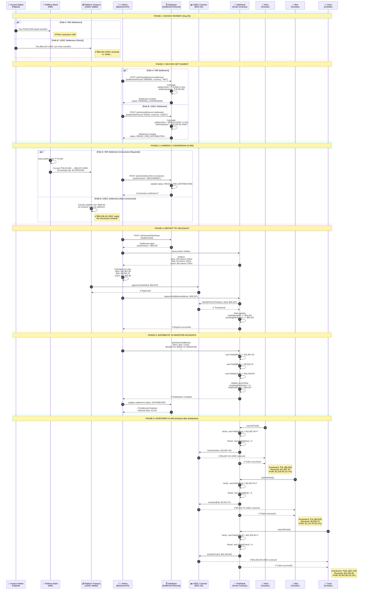

# Settlement & Yield Distribution Flow

## Overview

This document explains **exactly** what happens when an invoice is paid, how platform fees are handled, and how investors receive their returns.

The platform supports **two settlement options**:
- **Option A**: Debtor pays in INR → Platform converts to USDC
- **Option B**: Debtor pays directly in USDC (preferred for efficiency)

---

## Settlement Options Comparison

| Aspect | Path A: INR Settlement | Path B: USDC Settlement |
|--------|----------------------|------------------------|
| **Payment Method** | Bank transfer (₹50L) | On-chain USDC transfer ($60,240) |
| **Platform Fee** | ₹75,000 (kept as INR or converted) | $903.60 USDC (on-chain) |
| **Conversion Required?** | ✅ Yes - ₹49.25L → USDC | ❌ No - Already in USDC |
| **Extra Steps** | Confirm conversion API call | None |
| **Time to Distribute** | ~1-2 days (conversion time) | ~1 hour (immediate) |
| **Exchange Rate Risk** | ✅ Yes (INR/USD fluctuation) | ❌ No risk |
| **Transaction Costs** | Higher (bank fees + conversion) | Lower (only gas fees) |
| **Transparency** | Off-chain conversion, less visible | Fully on-chain, transparent |
| **When to Use** | Debtor prefers INR payment | Debtor can pay in stablecoins |
| **Status After Recording** | `PENDING_CONVERSION` | `READY_FOR_DISTRIBUTION` |

**Recommendation:** Encourage debtors to pay directly in USDC for faster, cheaper, and more transparent settlements.

---

## The Complete Journey

### **Phase 1: Invoice Payment (Off-chain)**
**Day 90** - Invoice debtor pays the platform

**Option A: INR Payment (Traditional)**
```
Flipkart pays ₹50,00,000 → Platform Bank Account (INR)
```

**Option B: USDC Payment (Direct)**
```
Flipkart pays $60,240 USDC → Platform Wallet (0x...)
```

**What platform has:**
- ✅ Settlement amount (INR or USDC)
- ✅ Record of all investors who bought tokens
- ✅ Record of how much each investor paid

---

### **Phase 2: Admin Records Settlement (Backend)**
**Day 90** - Admin initiates settlement process

**Admin Action (INR Settlement):**
```bash
POST /admin/yield/record-settlement

{
  "assetId": "abc-123",
  "settlementAmount": 5000000,  # ₹50L received
  "settlementDate": "2025-12-25",
  "currency": "INR"
}
```

**Admin Action (USDC Settlement - Direct):**
```bash
POST /admin/yield/record-settlement

{
  "assetId": "abc-123",
  "settlementAmount": 60240,  # $60,240 USDC received
  "settlementDate": "2025-12-25",
  "currency": "USDC",
  "txHash": "0x..."  # Transaction hash of USDC payment
}
```

**Backend Processing (INR Settlement):**
```typescript
// 1. Load asset data
const asset = await Asset.findOne({ assetId: "abc-123" });
const invoiceValue = 5000000;  // ₹50L
const amountRaised = asset.listing.amountRaised;  // e.g., ₹32L

// 2. Calculate fees and distribution
const platformFeeRate = 0.015;  // 1.5%
const platformFee = invoiceValue * platformFeeRate;  // ₹75,000
const netDistribution = invoiceValue - platformFee;  // ₹49,25,000

// 3. Create settlement record
const settlement = await Settlement.create({
  assetId: "abc-123",
  settlementAmount: 5000000,
  amountRaised: 3200000,  // What investors paid
  platformFeeRate: 0.015,
  platformFee: 75000,
  netDistribution: 4925000,
  currency: "INR",
  status: "PENDING_CONVERSION"
});
```

**Backend Processing (USDC Settlement - Direct):**
```typescript
// 1. Load asset data
const asset = await Asset.findOne({ assetId: "abc-123" });
const settlementAmountUSDC = 60240;  // $60,240 USDC received
const amountRaised = asset.listing.amountRaised;  // e.g., ₹32L

// 2. Calculate fees and distribution (in USDC)
const platformFeeRate = 0.015;  // 1.5%
const platformFeeUSDC = settlementAmountUSDC * platformFeeRate;  // $903.60
const netDistributionUSDC = settlementAmountUSDC - platformFeeUSDC;  // $59,336.40

// 3. Create settlement record (already in USDC!)
const settlement = await Settlement.create({
  assetId: "abc-123",
  settlementAmount: 60240,  // Already in USDC
  amountRaised: 3200000,  // What investors paid (in INR for tracking)
  platformFeeRate: 0.015,
  platformFee: 903.60,  // Platform fee in USDC
  netDistribution: 59336.40,  // Net in USDC
  usdcAmount: "59336400000",  // 6 decimals (ready for distribution)
  currency: "USDC",
  status: "READY_FOR_DISTRIBUTION"  // Skip conversion step!
});
```

**Database State (INR Settlement):**
```
Settlement Created:
├─ Settlement Amount: ₹50,00,000 (received from debtor)
├─ Amount Raised: ₹32,00,000 (paid by investors)
├─ Platform Fee: ₹75,000 (1.5%)
├─ Net Distribution: ₹49,25,000 (to be distributed)
├─ Currency: INR
└─ Status: PENDING_CONVERSION
```

**Database State (USDC Settlement):**
```
Settlement Created:
├─ Settlement Amount: $60,240 USDC (received from debtor)
├─ Amount Raised: ₹32,00,000 (paid by investors)
├─ Platform Fee: $903.60 USDC (1.5%)
├─ Net Distribution: $59,336.40 USDC (to be distributed)
├─ USDC Amount: 59,336.40 USDC (already converted ✓)
├─ Currency: USDC
└─ Status: READY_FOR_DISTRIBUTION (no conversion needed!)
```

---

### **Phase 3: Currency Conversion (Off-chain)**
**Day 90** - Platform converts INR to USDC (if needed)

#### **Path A: INR Settlement (Requires Conversion)**

**Platform Actions:**
1. Keep platform fee: ₹75,000 → Platform revenue account
2. Convert remainder: ₹49,25,000 INR → USDC

**Conversion Example:**
```
₹49,25,000 INR ÷ 83 (exchange rate) = $59,337 USDC
```

**Admin Confirms Conversion:**
```bash
POST /admin/yield/confirm-conversion

{
  "settlementId": "settlement-xyz",
  "usdcAmount": "59337000000"  # In 6 decimals (USDC wei)
}
```

**Backend Update:**
```typescript
await Settlement.updateOne(
  { _id: "settlement-xyz" },
  {
    usdcAmount: "59337000000",  // $59,337 in USDC wei
    status: "READY_FOR_DISTRIBUTION"
  }
);
```

**Database State After Conversion:**
```
Settlement Updated:
├─ Settlement Amount: ₹50,00,000
├─ Platform Fee: ₹75,000 (kept by platform ✓)
├─ Net Distribution: ₹49,25,000
├─ USDC Amount: 59,337 USDC (converted ✓)
└─ Status: READY_FOR_DISTRIBUTION
```

#### **Path B: USDC Settlement (Skip Conversion)**

**Platform Actions:**
1. Transfer platform fee: $903.60 USDC → Platform treasury wallet
2. Keep remainder in custody wallet: $59,336.40 USDC

**No conversion needed!** Settlement is already in USDC and marked `READY_FOR_DISTRIBUTION`.

**Database State:**
```
Settlement (Already Ready):
├─ Settlement Amount: $60,240 USDC
├─ Platform Fee: $903.60 USDC (transferred to treasury ✓)
├─ USDC Amount: $59,336.40 USDC (ready for vault ✓)
└─ Status: READY_FOR_DISTRIBUTION
```

---

### **Phase 4: Distribution to YieldVault (On-chain)**
**Day 90-91** - Platform deposits USDC to YieldVault contract

**Admin Triggers Distribution:**
```bash
POST /admin/yield/distribute

{
  "settlementId": "settlement-xyz"
}
```

**Backend Processing:**

**Step 4.1: Get All Token Holders**
```typescript
// Query blockchain for all current token holders
const holders = await TokenHolderTrackingService.getHolders(tokenAddress);

// Result:
[
  { address: "0xAlice", balance: "10000000000000000000000" },  // 10k tokens
  { address: "0xBob", balance: "5000000000000000000000" },    // 5k tokens
  { address: "0xCarol", balance: "35000000000000000000000" }, // 35k tokens
]
```

**Step 4.2: Calculate Pro-Rata Distribution**
```typescript
const totalSupply = 50000; // 50k tokens total
const usdcTotal = 59337000000; // $59,337 USDC

const distributions = [
  {
    address: "0xAlice",
    tokens: 10000,
    share: 10000 / 50000 = 0.20,  // 20%
    usdcAmount: 59337 * 0.20 = 11,867.4 USDC
  },
  {
    address: "0xBob",
    tokens: 5000,
    share: 5000 / 50000 = 0.10,  // 10%
    usdcAmount: 59337 * 0.10 = 5,933.7 USDC
  },
  {
    address: "0xCarol",
    tokens: 35000,
    share: 35000 / 50000 = 0.70,  // 70%
    usdcAmount: 59337 * 0.70 = 41,535.9 USDC
  }
];
```

**Step 4.3: Deposit to YieldVault**
```typescript
// Platform wallet approves YieldVault to spend USDC
await USDC.approve(YieldVaultAddress, 59337000000);

// Backend calls blockchain service
await blockchainService.depositYield(
  tokenAddress,
  "59337000000"  // Full amount
);
```

**Smart Contract Call:**
```solidity
// YieldVault.depositYield()
function depositYield(address tokenAddress, uint256 amount) external onlyPlatform {
  // Transfer USDC from platform → YieldVault
  USDC.transferFrom(msg.sender, address(this), amount);

  // Update vault accounting
  assets[tokenAddress].totalDeposited += amount;
  assets[tokenAddress].pendingDistribution += amount;

  emit YieldDeposited(tokenAddress, amount, block.timestamp);
}
```

**On-Chain State After Deposit:**
```
YieldVault Contract:
├─ USDC Balance: 59,337 USDC ✓
├─ Pending Distribution: 59,337 USDC
└─ Ready to distribute to investors
```

---

### **Phase 5: Distribute to Investor Accounts (On-chain)**
**Day 91** - Backend distributes yield to each investor's claimable balance

**Backend Batch Distribution:**
```typescript
// Process in batches of 50 holders
const batchSize = 50;
for (let i = 0; i < distributions.length; i += batchSize) {
  const batch = distributions.slice(i, i + batchSize);

  const addresses = batch.map(d => d.address);
  const amounts = batch.map(d => d.usdcAmount);

  // Call smart contract
  await blockchainService.distributeYield(
    tokenAddress,
    addresses,
    amounts
  );
}
```

**Smart Contract Calls:**
```solidity
// YieldVault.distributeYieldBatch()
function distributeYieldBatch(
  address tokenAddress,
  address[] calldata holders,
  uint256[] calldata amounts
) external onlyPlatform {

  uint256 totalAmount = 0;

  // Update each user's claimable balance
  for (uint256 i = 0; i < holders.length; i++) {
    userYields[holders[i]].totalClaimable += amounts[i];
    totalAmount += amounts[i];
  }

  // Update vault accounting
  assets[tokenAddress].pendingDistribution -= totalAmount;
  assets[tokenAddress].totalDistributed += totalAmount;

  emit YieldDistributed(tokenAddress, totalAmount, holders.length);
}
```

**After Distribution:**
```
YieldVault Contract State:
├─ USDC Balance: 59,337 USDC (still in vault)
├─ Pending Distribution: 0 USDC (all allocated)
├─ Total Distributed: 59,337 USDC
└─ User Claimable Balances:
    ├─ Alice: 11,867.4 USDC ✓
    ├─ Bob: 5,933.7 USDC ✓
    └─ Carol: 41,535.9 USDC ✓
```

---

### **Phase 6: Investors Claim Their Returns (On-chain)**
**Day 91+** - Investors claim whenever they want

**Investor Action (Alice):**
```typescript
// Alice calls YieldVault.claimAllYield()
const tx = await YieldVault.claimAllYield();
```

**Smart Contract Execution:**
```solidity
function claimAllYield() external {
  uint256 claimable = userYields[msg.sender].totalClaimable;
  require(claimable > 0, "Nothing to claim");

  // Reset claimable balance
  userYields[msg.sender].totalClaimable = 0;
  userYields[msg.sender].lastClaimTime = block.timestamp;

  // Transfer USDC from vault → investor
  USDC.transfer(msg.sender, claimable);

  emit YieldClaimed(msg.sender, claimable, block.timestamp);
}
```

**Result:**
```
Alice's Wallet:
├─ Before: 0 USDC
├─ After: 11,867.4 USDC ✓
└─ Investment: $6,400 (₹8L @ ₹80/token × 10k tokens)
    Profit: $5,467.4 (85.4% return!)
```

---

## Complete Sequence Diagram

### Comprehensive Flow (Both Settlement Options)



---

## Money Flow Breakdown

### **Path A: INR Settlement - What Happens to the ₹50,00,000?**

```
₹50,00,000 (Invoice Payment from Flipkart)
    │
    ├─→ ₹75,000 (1.5% Platform Fee)
    │   └─→ Platform Revenue Account (kept as INR) ✓
    │
    └─→ ₹49,25,000 (Net Distribution)
        └─→ Convert to USDC @ 83 INR/USD → $59,337
            └─→ Transfer to YieldVault Contract
                └─→ Distributed to investors:
                    ├─→ Alice: $11,867.40 (20%)
                    ├─→ Bob: $5,933.70 (10%)
                    └─→ Carol: $41,535.90 (70%)
```

### **Path B: USDC Settlement - What Happens to the $60,240?**

```
$60,240 USDC (Invoice Payment from Flipkart)
    │
    ├─→ $903.60 USDC (1.5% Platform Fee)
    │   └─→ Platform Treasury Wallet (USDC) ✓
    │
    └─→ $59,336.40 USDC (Net Distribution)
        └─→ Already in USDC (no conversion needed) ✓
            └─→ Transfer to YieldVault Contract
                └─→ Distributed to investors:
                    ├─→ Alice: $11,867.28 (20%)
                    ├─→ Bob: $5,933.64 (10%)
                    └─→ Carol: $41,535.48 (70%)
```

**Key Difference:**
- **INR Path**: Platform keeps fee as INR, converts remainder to USDC
- **USDC Path**: Platform keeps fee as USDC, no conversion needed (more efficient!)

---

## Platform Fee Handling

### **Where Does Platform Fee Go?**

#### **For INR Settlements:**

**Option 1: Keep as INR (Simplest)**
```
Platform Fee: ₹75,000
Action: Keep in platform bank account
Use: Operating expenses, marketing, salaries, rent
Advantage: No conversion cost, immediate availability for fiat expenses
```

**Option 2: Convert to USDC**
```
Platform Fee: ₹75,000 → ~$904 USDC
Action: Transfer to platform treasury wallet
Use: On-chain operations, reserves, crypto expenses
Advantage: Hedges against INR depreciation
```

**Option 3: Split (Recommended)**
```
₹75,000 total:
├─→ ₹50,000 (INR) - Keep for operating expenses
└─→ ₹25,000 → $301 USDC - Convert to treasury reserves
```

#### **For USDC Settlements:**

**Direct Transfer (Automatic)**
```
Platform Fee: $903.60 USDC
Action: Transfer to platform treasury wallet
Use: On-chain operations, reserves, or convert to INR as needed
Advantage: No conversion required, already on-chain
```

**Implementation:**
```typescript
async recordSettlement(dto: RecordSettlementDto) {
  const platformFeeRate = 0.015;  // 1.5%

  if (dto.currency === 'INR') {
    // INR Settlement
    const platformFee = dto.settlementAmount * platformFeeRate;  // ₹75,000
    const netDistribution = dto.settlementAmount - platformFee;  // ₹49.25L

    // Platform keeps ₹75K in bank account (or splits it)
    return {
      platformFee,
      netDistribution,
      status: 'PENDING_CONVERSION'
    };
  } else {
    // USDC Settlement
    const platformFeeUSDC = dto.settlementAmount * platformFeeRate;  // $903.60
    const netDistributionUSDC = dto.settlementAmount - platformFeeUSDC;  // $59,336.40

    // Transfer platform fee to treasury wallet
    await this.blockchainService.transferUSDC(
      PLATFORM_TREASURY_ADDRESS,
      platformFeeUSDC
    );

    return {
      platformFee: platformFeeUSDC,
      netDistribution: netDistributionUSDC,
      status: 'READY_FOR_DISTRIBUTION'  // Skip conversion!
    };
  }
}
```

---

## Investor Payout Calculation

### **Example: Alice's Journey**

**Primary Sale (Day 0):**
```
Alice buys: 10,000 tokens @ ₹80/token
Alice pays: ₹8,00,000 ($9,638 @ 83 INR/USD)
Alice's share: 10,000 / 50,000 = 20%
```

**Settlement (Day 90):**
```
Total raised: ₹32,00,000
Settlement: ₹50,00,000
Net distribution: ₹49,25,000 → $59,337 USDC

Alice's payout calculation:
├─ Token share: 10,000 / 50,000 = 20%
├─ USDC amount: $59,337 × 20% = $11,867.4
└─ Claimable: $11,867.4 USDC
```

**Return Calculation:**
```
Invested: $9,638 (at Day 0 rates)
Received: $11,867.4
Profit: $2,229.4
Return: 23.1% in 90 days
APR: ~92.4%
```

---

## Smart Contract State Transitions

### **YieldVault State Through Process**

**Initial State:**
```solidity
assets[tokenAddress] = {
  tokenAddress: 0xTOKEN,
  assetId: 0xASSET,
  totalDeposited: 0,
  totalDistributed: 0,
  pendingDistribution: 0
}

userYields[Alice] = {
  totalClaimable: 0,
  lastClaimTime: 0
}
```

**After depositYield():**
```solidity
assets[tokenAddress] = {
  totalDeposited: 59337000000,      // +$59,337
  totalDistributed: 0,
  pendingDistribution: 59337000000   // +$59,337
}

USDC.balanceOf(YieldVault) = 59337000000  // Vault holds USDC
```

**After distributeYieldBatch():**
```solidity
assets[tokenAddress] = {
  totalDeposited: 59337000000,
  totalDistributed: 59337000000,     // +$59,337
  pendingDistribution: 0              // -$59,337 (allocated)
}

userYields[Alice] = {
  totalClaimable: 11867400000,       // +$11,867.4
  lastClaimTime: 0
}

USDC.balanceOf(YieldVault) = 59337000000  // Still in vault (not claimed yet)
```

**After Alice claims:**
```solidity
userYields[Alice] = {
  totalClaimable: 0,                  // -$11,867.4 (claimed)
  lastClaimTime: block.timestamp
}

USDC.balanceOf(YieldVault) = 47469600000  // -$11,867.4
USDC.balanceOf(Alice) = 11867400000        // +$11,867.4 ✓
```

---

## Key Takeaways

### **For Platform:**
1. ✅ Platform fee (1.5%) deducted BEFORE conversion
2. ✅ Platform keeps ₹75,000 as revenue
3. ✅ Remaining ₹49.25L converted to USDC
4. ✅ Platform pays gas for distribution (small cost)

### **For Investors:**
1. ✅ Receive proportional share of net distribution
2. ✅ No additional fees when claiming
3. ✅ Can claim anytime (no deadline)
4. ✅ Yield = (distribution - invested) / invested

### **For Smart Contracts:**
1. ✅ YieldVault holds all USDC until claimed
2. ✅ Distribution is pro-rata by token balance
3. ✅ Each investor's claim is isolated (no impact on others)
4. ✅ Unclaimed yield stays in vault indefinitely

---

## Summary

### **Settlement Flow Overview:**

**Path A: INR Settlement**
```
Invoice Paid (INR) → Platform Fee Extracted (INR) → INR→USDC Conversion →
Deposit to Vault → Distribute to Accounts → Investors Claim
```

**Path B: USDC Settlement (Preferred)**
```
Invoice Paid (USDC) → Platform Fee Extracted (USDC) →
Deposit to Vault → Distribute to Accounts → Investors Claim
```

### **Key Takeaways:**

**Platform Revenue:**
- ✅ Always earns 1.5% of settlement amount
- ✅ INR settlements: Keep fee as INR or convert to USDC
- ✅ USDC settlements: Fee automatically in USDC (more efficient!)

**Investor Returns:**
- ✅ Receive proportional share of (settlement - platform fee)
- ✅ Distribution based on token holdings at settlement time
- ✅ Can claim anytime after distribution (no deadline)
- ✅ Zero claiming fees (platform pays gas)

**Dynamic Yield Model:**
- ✅ The less investors paid during primary sale, the higher their return at settlement
- ✅ Example: ₹32L raised on ₹50L invoice → 53.9% yield
- ✅ Example: ₹49L raised on ₹50L invoice → 0.51% yield
- ✅ Market-driven pricing creates competitive investment opportunities

**Why USDC Direct Settlement is Better:**
- ✅ No currency conversion step (saves time)
- ✅ No exchange rate risk
- ✅ Lower transaction costs
- ✅ Faster distribution to investors
- ✅ On-chain transparency from start to finish
