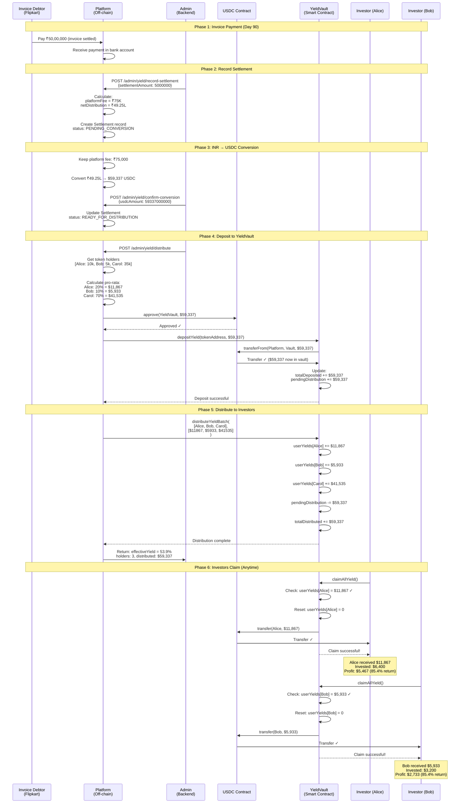

# Settlement & Yield Distribution Flow

## Overview

This document explains **exactly** what happens when an invoice is paid, how platform fees are handled, and how investors receive their returns.

---

## The Complete Journey

### **Phase 1: Invoice Payment (Off-chain)**
**Day 90** - Invoice debtor pays the platform

```
Flipkart pays ₹50,00,000 → Platform Bank Account
```

**What platform has:**
- ✅ ₹50,00,000 in bank (INR)
- ✅ Record of all investors who bought tokens
- ✅ Record of how much each investor paid

---

### **Phase 2: Admin Records Settlement (Backend)**
**Day 90** - Admin initiates settlement process

**Admin Action:**
```bash
POST /admin/yield/record-settlement

{
  "assetId": "abc-123",
  "settlementAmount": 5000000,  # ₹50L received
  "settlementDate": "2025-12-25",
  "currency": "INR"
}
```

**Backend Processing:**
```typescript
// 1. Load asset data
const asset = await Asset.findOne({ assetId: "abc-123" });
const invoiceValue = 5000000;  // ₹50L
const amountRaised = asset.listing.amountRaised;  // e.g., ₹32L

// 2. Calculate fees and distribution
const platformFeeRate = 0.015;  // 1.5%
const platformFee = invoiceValue * platformFeeRate;  // ₹75,000
const netDistribution = invoiceValue - platformFee;  // ₹49,25,000

// 3. Create settlement record
const settlement = await Settlement.create({
  assetId: "abc-123",
  settlementAmount: 5000000,
  amountRaised: 3200000,  // What investors paid
  platformFeeRate: 0.015,
  platformFee: 75000,
  netDistribution: 4925000,
  status: "PENDING_CONVERSION"
});
```

**Database State:**
```
Settlement Created:
├─ Settlement Amount: ₹50,00,000 (received from debtor)
├─ Amount Raised: ₹32,00,000 (paid by investors)
├─ Platform Fee: ₹75,000 (1.5%)
├─ Net Distribution: ₹49,25,000 (to be distributed)
└─ Status: PENDING_CONVERSION
```

---

### **Phase 3: INR → USDC Conversion (Off-chain)**
**Day 90** - Platform converts INR to USDC

**Platform Actions:**
1. Keep platform fee: ₹75,000 → Platform revenue account
2. Convert remainder: ₹49,25,000 INR → USDC

**Conversion Example:**
```
₹49,25,000 INR ÷ 83 (exchange rate) = $59,337 USDC
```

**Admin Confirms Conversion:**
```bash
POST /admin/yield/confirm-conversion

{
  "settlementId": "settlement-xyz",
  "usdcAmount": "59337000000"  # In 6 decimals (USDC wei)
}
```

**Backend Update:**
```typescript
await Settlement.updateOne(
  { _id: "settlement-xyz" },
  {
    usdcAmount: "59337000000",  // $59,337 in USDC wei
    status: "READY_FOR_DISTRIBUTION"
  }
);
```

**Database State:**
```
Settlement Updated:
├─ Settlement Amount: ₹50,00,000
├─ Platform Fee: ₹75,000 (kept by platform ✓)
├─ Net Distribution: ₹49,25,000
├─ USDC Amount: 59,337 USDC (converted ✓)
└─ Status: READY_FOR_DISTRIBUTION
```

---

### **Phase 4: Distribution to YieldVault (On-chain)**
**Day 90-91** - Platform deposits USDC to YieldVault contract

**Admin Triggers Distribution:**
```bash
POST /admin/yield/distribute

{
  "settlementId": "settlement-xyz"
}
```

**Backend Processing:**

**Step 4.1: Get All Token Holders**
```typescript
// Query blockchain for all current token holders
const holders = await TokenHolderTrackingService.getHolders(tokenAddress);

// Result:
[
  { address: "0xAlice", balance: "10000000000000000000000" },  // 10k tokens
  { address: "0xBob", balance: "5000000000000000000000" },    // 5k tokens
  { address: "0xCarol", balance: "35000000000000000000000" }, // 35k tokens
]
```

**Step 4.2: Calculate Pro-Rata Distribution**
```typescript
const totalSupply = 50000; // 50k tokens total
const usdcTotal = 59337000000; // $59,337 USDC

const distributions = [
  {
    address: "0xAlice",
    tokens: 10000,
    share: 10000 / 50000 = 0.20,  // 20%
    usdcAmount: 59337 * 0.20 = 11,867.4 USDC
  },
  {
    address: "0xBob",
    tokens: 5000,
    share: 5000 / 50000 = 0.10,  // 10%
    usdcAmount: 59337 * 0.10 = 5,933.7 USDC
  },
  {
    address: "0xCarol",
    tokens: 35000,
    share: 35000 / 50000 = 0.70,  // 70%
    usdcAmount: 59337 * 0.70 = 41,535.9 USDC
  }
];
```

**Step 4.3: Deposit to YieldVault**
```typescript
// Platform wallet approves YieldVault to spend USDC
await USDC.approve(YieldVaultAddress, 59337000000);

// Backend calls blockchain service
await blockchainService.depositYield(
  tokenAddress,
  "59337000000"  // Full amount
);
```

**Smart Contract Call:**
```solidity
// YieldVault.depositYield()
function depositYield(address tokenAddress, uint256 amount) external onlyPlatform {
  // Transfer USDC from platform → YieldVault
  USDC.transferFrom(msg.sender, address(this), amount);

  // Update vault accounting
  assets[tokenAddress].totalDeposited += amount;
  assets[tokenAddress].pendingDistribution += amount;

  emit YieldDeposited(tokenAddress, amount, block.timestamp);
}
```

**On-Chain State After Deposit:**
```
YieldVault Contract:
├─ USDC Balance: 59,337 USDC ✓
├─ Pending Distribution: 59,337 USDC
└─ Ready to distribute to investors
```

---

### **Phase 5: Distribute to Investor Accounts (On-chain)**
**Day 91** - Backend distributes yield to each investor's claimable balance

**Backend Batch Distribution:**
```typescript
// Process in batches of 50 holders
const batchSize = 50;
for (let i = 0; i < distributions.length; i += batchSize) {
  const batch = distributions.slice(i, i + batchSize);

  const addresses = batch.map(d => d.address);
  const amounts = batch.map(d => d.usdcAmount);

  // Call smart contract
  await blockchainService.distributeYield(
    tokenAddress,
    addresses,
    amounts
  );
}
```

**Smart Contract Calls:**
```solidity
// YieldVault.distributeYieldBatch()
function distributeYieldBatch(
  address tokenAddress,
  address[] calldata holders,
  uint256[] calldata amounts
) external onlyPlatform {

  uint256 totalAmount = 0;

  // Update each user's claimable balance
  for (uint256 i = 0; i < holders.length; i++) {
    userYields[holders[i]].totalClaimable += amounts[i];
    totalAmount += amounts[i];
  }

  // Update vault accounting
  assets[tokenAddress].pendingDistribution -= totalAmount;
  assets[tokenAddress].totalDistributed += totalAmount;

  emit YieldDistributed(tokenAddress, totalAmount, holders.length);
}
```

**After Distribution:**
```
YieldVault Contract State:
├─ USDC Balance: 59,337 USDC (still in vault)
├─ Pending Distribution: 0 USDC (all allocated)
├─ Total Distributed: 59,337 USDC
└─ User Claimable Balances:
    ├─ Alice: 11,867.4 USDC ✓
    ├─ Bob: 5,933.7 USDC ✓
    └─ Carol: 41,535.9 USDC ✓
```

---

### **Phase 6: Investors Claim Their Returns (On-chain)**
**Day 91+** - Investors claim whenever they want

**Investor Action (Alice):**
```typescript
// Alice calls YieldVault.claimAllYield()
const tx = await YieldVault.claimAllYield();
```

**Smart Contract Execution:**
```solidity
function claimAllYield() external {
  uint256 claimable = userYields[msg.sender].totalClaimable;
  require(claimable > 0, "Nothing to claim");

  // Reset claimable balance
  userYields[msg.sender].totalClaimable = 0;
  userYields[msg.sender].lastClaimTime = block.timestamp;

  // Transfer USDC from vault → investor
  USDC.transfer(msg.sender, claimable);

  emit YieldClaimed(msg.sender, claimable, block.timestamp);
}
```

**Result:**
```
Alice's Wallet:
├─ Before: 0 USDC
├─ After: 11,867.4 USDC ✓
└─ Investment: $6,400 (₹8L @ ₹80/token × 10k tokens)
    Profit: $5,467.4 (85.4% return!)
```

---

## Complete Sequence Diagram



---

## Money Flow Breakdown

### **What Happens to the ₹50,00,000?**

```
₹50,00,000 (Invoice Payment from Flipkart)
    │
    ├─→ ₹75,000 (1.5% Platform Fee)
    │   └─→ Platform Revenue Account ✓
    │
    └─→ ₹49,25,000 (Net Distribution)
        └─→ Convert to USDC → $59,337
            └─→ Transfer to YieldVault Contract
                └─→ Distributed to investors:
                    ├─→ Alice: $11,867 (20%)
                    ├─→ Bob: $5,933 (10%)
                    └─→ Carol: $41,535 (70%)
```

---

## Platform Fee Handling

### **Where Does Platform Fee Go?**

**Option 1: Keep as INR (Current)**
```
Platform Fee: ₹75,000
Action: Keep in platform bank account
Use: Operating expenses, marketing, etc.
```

**Option 2: Convert to USDC**
```
Platform Fee: ₹75,000 → ~$904 USDC
Action: Transfer to platform treasury wallet
Use: On-chain operations, reserves
```

**Option 3: Split**
```
₹75,000 total:
├─→ ₹50,000 (INR) - Operating expenses
└─→ ₹25,000 → $301 USDC - Treasury reserves
```

**Implementation:**
```typescript
async recordSettlement(dto: RecordSettlementDto) {
  // Calculate fees
  const platformFee = settlementAmount * 0.015;
  const netDistribution = settlementAmount - platformFee;

  // Track where platform fee goes
  const platformFeeAllocation = {
    totalFee: platformFee,  // ₹75,000
    operatingExpenses: platformFee * 0.67,  // ₹50,000 (kept as INR)
    treasuryReserves: platformFee * 0.33,   // ₹25,000 (convert to USDC)
  };

  // Only convert netDistribution + treasury portion to USDC
  const usdcConversionAmount = netDistribution + platformFeeAllocation.treasuryReserves;
}
```

---

## Investor Payout Calculation

### **Example: Alice's Journey**

**Primary Sale (Day 0):**
```
Alice buys: 10,000 tokens @ ₹80/token
Alice pays: ₹8,00,000 ($9,638 @ 83 INR/USD)
Alice's share: 10,000 / 50,000 = 20%
```

**Settlement (Day 90):**
```
Total raised: ₹32,00,000
Settlement: ₹50,00,000
Net distribution: ₹49,25,000 → $59,337 USDC

Alice's payout calculation:
├─ Token share: 10,000 / 50,000 = 20%
├─ USDC amount: $59,337 × 20% = $11,867.4
└─ Claimable: $11,867.4 USDC
```

**Return Calculation:**
```
Invested: $9,638 (at Day 0 rates)
Received: $11,867.4
Profit: $2,229.4
Return: 23.1% in 90 days
APR: ~92.4%
```

---

## Smart Contract State Transitions

### **YieldVault State Through Process**

**Initial State:**
```solidity
assets[tokenAddress] = {
  tokenAddress: 0xTOKEN,
  assetId: 0xASSET,
  totalDeposited: 0,
  totalDistributed: 0,
  pendingDistribution: 0
}

userYields[Alice] = {
  totalClaimable: 0,
  lastClaimTime: 0
}
```

**After depositYield():**
```solidity
assets[tokenAddress] = {
  totalDeposited: 59337000000,      // +$59,337
  totalDistributed: 0,
  pendingDistribution: 59337000000   // +$59,337
}

USDC.balanceOf(YieldVault) = 59337000000  // Vault holds USDC
```

**After distributeYieldBatch():**
```solidity
assets[tokenAddress] = {
  totalDeposited: 59337000000,
  totalDistributed: 59337000000,     // +$59,337
  pendingDistribution: 0              // -$59,337 (allocated)
}

userYields[Alice] = {
  totalClaimable: 11867400000,       // +$11,867.4
  lastClaimTime: 0
}

USDC.balanceOf(YieldVault) = 59337000000  // Still in vault (not claimed yet)
```

**After Alice claims:**
```solidity
userYields[Alice] = {
  totalClaimable: 0,                  // -$11,867.4 (claimed)
  lastClaimTime: block.timestamp
}

USDC.balanceOf(YieldVault) = 47469600000  // -$11,867.4
USDC.balanceOf(Alice) = 11867400000        // +$11,867.4 ✓
```

---

## Key Takeaways

### **For Platform:**
1. ✅ Platform fee (1.5%) deducted BEFORE conversion
2. ✅ Platform keeps ₹75,000 as revenue
3. ✅ Remaining ₹49.25L converted to USDC
4. ✅ Platform pays gas for distribution (small cost)

### **For Investors:**
1. ✅ Receive proportional share of net distribution
2. ✅ No additional fees when claiming
3. ✅ Can claim anytime (no deadline)
4. ✅ Yield = (distribution - invested) / invested

### **For Smart Contracts:**
1. ✅ YieldVault holds all USDC until claimed
2. ✅ Distribution is pro-rata by token balance
3. ✅ Each investor's claim is isolated (no impact on others)
4. ✅ Unclaimed yield stays in vault indefinitely

---

## Summary

**The Flow:**
```
Invoice Paid → Platform Fee Extracted → INR→USDC Conversion →
Deposit to Vault → Distribute to Accounts → Investors Claim
```

**Platform earns:** 1.5% of settlement (₹75,000)

**Investors earn:** Share of (settlement - platform fee) based on tokens held

**Dynamic yield:** The less investors paid during primary sale, the higher their return at settlement!
