# Yield Tracking - Time-Weighted Historical Distribution

## Overview

This document explains **exactly how** the platform tracks yield entitlement based on **how long each investor held tokens**, not just who holds them at settlement.

**Key Principle:** Yield is earned proportionally to **holding duration**, not just final ownership.

---

## The Problem

**Scenario:**
```
Day 0: You buy 500 tokens
Day 30: You sell 500 tokens to Buyer A
Day 90: Invoice settles, yield distributed
```

**Question:** Who gets the yield on those 500 tokens?

**Wrong Answer:** Only Buyer A (current holder) gets 100%

**Correct Answer:**
- You get 33.3% (held for 30 days)
- Buyer A gets 66.7% (held for 60 days)

**Why?** You both contributed capital over time. Yield should be proportional to holding duration.

---

## Time-Weighted Yield Model

### Formula

```
User's Yield Share = (User's Token-Days) / (Total Token-Days) × Total Yield
```

Where:
- **Token-Days** = Tokens held × Days held
- **Total Token-Days** = Sum of all token-days across all holders (past and present)

---

## Examples

### Example 1: Early Seller vs. Late Holder

**Scenario:**
```
Invoice: ₹50L, 50,000 tokens
Settlement: ₹50L → ₹49.25L net distribution → $59,337 USDC
Holding Period: 90 days (Day 0 to Day 90)
```

**Token Transfer History:**
```
Day 0:
  - You buy 500 tokens @ ₹80/token = ₹40,000 invested

Day 30:
  - You sell 500 tokens to Buyer A @ ₹90/token

Day 90:
  - Settlement occurs
```

**Yield Calculation:**

**Your token-days:**
```
500 tokens × 30 days = 15,000 token-days
```

**Buyer A's token-days:**
```
500 tokens × 60 days = 30,000 token-days
```

**Total token-days for these 500 tokens:**
```
15,000 + 30,000 = 45,000 token-days
```

**Total yield on these 500 tokens:**
```
500 / 50,000 = 1% of total yield
1% × $59,337 = $593.37 USDC
```

**Your share:**
```
15,000 / 45,000 = 33.3% of $593.37 = $197.79 USDC ✓
```

**Buyer A's share:**
```
30,000 / 45,000 = 66.7% of $593.37 = $395.58 USDC ✓
```

**Result:** Even though you sold, you still get 33.3% of the yield because you held for 1/3 of the duration!

---

### Example 2: Full-Term Holder

**Scenario:**
```
Buyer B buys 500 tokens on Day 0
Holds until settlement on Day 90
```

**Token-days:**
```
500 tokens × 90 days = 45,000 token-days
```

**Yield:**
```
Since Buyer B held for the full duration, they get 100% of the yield on their 500 tokens:
1% × $59,337 = $593.37 USDC ✓
```

---

### Example 3: Large Long-Term Holder

**Scenario:**
```
Buyer C buys 1,000 tokens on Day 0
Holds until settlement on Day 90
```

**Token-days:**
```
1,000 tokens × 90 days = 90,000 token-days
```

**Yield:**
```
2% × $59,337 = $1,186.74 USDC ✓
```

**Why more?** Buyer C held **2× the tokens** for the **same duration** = 2× the yield.

---

### Example 4: Complex Multi-Transfer Scenario

**Token History for a Single 500-Token Lot:**
```
Day 0-20:   Investor A holds (20 days)
Day 20-50:  Investor B holds (30 days)
Day 50-90:  Investor C holds (40 days)
```

**Token-days:**
```
Investor A: 500 × 20 = 10,000 token-days
Investor B: 500 × 30 = 15,000 token-days
Investor C: 500 × 40 = 20,000 token-days
Total: 45,000 token-days
```

**Yield on these 500 tokens:** $593.37 USDC

**Distribution:**
```
Investor A: (10,000 / 45,000) × $593.37 = $131.86 (22.2%)
Investor B: (15,000 / 45,000) × $593.37 = $197.79 (33.3%)
Investor C: (20,000 / 45,000) × $593.37 = $263.71 (44.4%)
```

**Result:** All three get their fair share based on how long they held!

---

## How YieldVault Tracks This

### Smart Contract State

The YieldVault contract maintains:

```solidity
struct UserYieldInfo {
    uint256 accumulatedYield;      // Yield earned so far
    uint256 lastUpdateTimestamp;   // When we last calculated
    uint256 currentBalance;        // Current token balance
    uint256 totalClaimable;        // Ready to claim
}

mapping(address => UserYieldInfo) public userYields;
```

### Tracking Mechanism

**On Every Token Transfer:**
1. **Before transfer**, YieldVault calculates accumulated yield for both sender and receiver
2. **Updates** their `accumulatedYield` based on time held
3. **Resets** their `lastUpdateTimestamp` to current time
4. **Updates** their `currentBalance`

**Formula for accumulated yield:**
```solidity
timeDelta = block.timestamp - user.lastUpdateTimestamp
tokenDays = user.currentBalance × timeDelta
accumulatedYield += (tokenDays / totalTokenDays) × yieldRate
```

---

## Complete Tracking Flow

### Sequence Diagram

```mermaid
sequenceDiagram
    autonumber
    participant You as 👤 You<br/>(Early Seller)
    participant BuyerA as 👤 Buyer A<br/>(Late Buyer)
    participant Token as 🪙 RWAToken<br/>(ERC-20)
    participant Vault as 🔐 YieldVault<br/>(Tracking)
    participant Admin as 👨‍💻 Admin<br/>(Settlement)

    rect rgb(240, 248, 255)
    Note over You,Admin: DAY 0: Initial Purchase
    end

    You->>Token: Buy 500 tokens
    Token->>Vault: updateTokenBalance(You, 0→500)
    Vault->>Vault: Initialize tracking:<br/>userYields[You].currentBalance = 500<br/>userYields[You].lastUpdateTimestamp = Day 0<br/>userYields[You].accumulatedYield = 0
    Note right of Vault: ⏱️ Tracking started for You

    rect rgb(255, 250, 240)
    Note over You,Admin: DAY 30: You Sell to Buyer A
    end

    You->>Token: transfer(BuyerA, 500 tokens)

    Token->>Vault: BEFORE transfer - updateTokenBalance(You, 500→0)
    Vault->>Vault: Calculate Your accumulated yield:<br/>timeDelta = 30 days<br/>tokenDays = 500 × 30 = 15,000<br/>accumulatedYield[You] += yield_earned
    Note right of Vault: ✅ Your 30 days recorded

    Token->>Vault: AFTER transfer - updateTokenBalance(BuyerA, 0→500)
    Vault->>Vault: Initialize for Buyer A:<br/>userYields[BuyerA].currentBalance = 500<br/>userYields[BuyerA].lastUpdateTimestamp = Day 30<br/>userYields[BuyerA].accumulatedYield = 0
    Note right of Vault: ⏱️ Tracking started for Buyer A

    Token-->>You: Transfer complete
    Note right of You: You have 0 tokens now,<br/>but yield is saved!

    rect rgb(240, 255, 240)
    Note over You,Admin: DAY 90: Settlement & Distribution
    end

    Admin->>Vault: depositYield(tokenAddress, $59,337)
    Vault->>Vault: USDC received, ready to calculate

    Admin->>Vault: distributeYield()

    Vault->>Vault: Calculate Buyer A's final yield:<br/>timeDelta = 60 days (Day 30→90)<br/>tokenDays = 500 × 60 = 30,000<br/>accumulatedYield[BuyerA] += yield_earned

    Vault->>Vault: Calculate total token-days:<br/>You: 15,000<br/>Buyer A: 30,000<br/>Others: 4,455,000<br/>Total: 4,500,000 token-days

    Vault->>Vault: Distribute $59,337 USDC:<br/><br/>Your share:<br/>(15,000 / 4,500,000) × $59,337<br/>= $197.79 USDC<br/><br/>Buyer A's share:<br/>(30,000 / 4,500,000) × $59,337<br/>= $395.58 USDC

    Vault->>Vault: Update claimable balances:<br/>userYields[You].totalClaimable = $197.79<br/>userYields[BuyerA].totalClaimable = $395.58

    Vault-->>Admin: Distribution complete

    rect rgb(255, 240, 255)
    Note over You,Admin: DAY 91+: Claiming
    end

    You->>Vault: claimAllYield()
    Vault->>Vault: Verify: totalClaimable[You] = $197.79 ✓
    Vault->>You: Transfer $197.79 USDC
    Note right of You: ✅ Received yield for 30 days

    BuyerA->>Vault: claimAllYield()
    Vault->>Vault: Verify: totalClaimable[BuyerA] = $395.58 ✓
    Vault->>BuyerA: Transfer $395.58 USDC
    Note right of BuyerA: ✅ Received yield for 60 days
```



---

## Technical Implementation

### 1. Token Transfer Hook

Every time RWAToken transfers happen, the token contract calls YieldVault:

```solidity
// In RWAToken.sol
function _update(address from, address to, uint256 value) internal override {
    // Before transfer - update sender's yield
    if (from != address(0)) {
        yieldVault.updateTokenBalance(from, balanceOf(from), balanceOf(from) - value);
    }

    // Execute transfer
    super._update(from, to, value);

    // After transfer - update receiver's yield
    if (to != address(0)) {
        yieldVault.updateTokenBalance(to, balanceOf(to) - value, balanceOf(to));
    }
}
```

### 2. YieldVault Tracking Update

```solidity
// In YieldVault.sol
function updateTokenBalance(
    address holder,
    uint256 oldBalance,
    uint256 newBalance
) external onlyToken {
    UserYieldInfo storage info = userYields[holder];

    // Calculate time since last update
    uint256 timeDelta = block.timestamp - info.lastUpdateTimestamp;

    if (timeDelta > 0 && oldBalance > 0) {
        // Calculate yield earned during this period
        uint256 tokenDays = oldBalance * timeDelta;

        // Add to accumulated yield (will be converted to USDC at settlement)
        info.accumulatedYield += tokenDays;
    }

    // Update state
    info.currentBalance = newBalance;
    info.lastUpdateTimestamp = block.timestamp;

    emit TokenBalanceUpdated(holder, oldBalance, newBalance, block.timestamp);
}
```

### 3. Settlement Distribution

```solidity
// In YieldVault.sol
function distributeYieldBatch(
    address tokenAddress,
    address[] calldata holders,
    uint256[] calldata amounts  // Pre-calculated by backend
) external onlyPlatform {

    for (uint256 i = 0; i < holders.length; i++) {
        // Update claimable balance for each holder
        userYields[holders[i]].totalClaimable += amounts[i];
    }

    emit YieldDistributed(tokenAddress, totalAmount, holders.length);
}
```

**Note:** The backend calculates the exact USDC amounts based on token-days and passes them to the contract.

---

## Backend Calculation Logic

### How Backend Calculates Distribution

```typescript
async function calculateTimeWeightedDistribution(
  tokenAddress: string,
  totalUSDC: bigint
): Promise<Map<string, bigint>> {

  // 1. Get all historical token holders
  const allHolders = await getHistoricalHolders(tokenAddress);

  // 2. Calculate token-days for each holder
  const tokenDays = new Map<string, number>();

  for (const holder of allHolders) {
    const holdings = await getHoldingHistory(holder.address, tokenAddress);

    let totalTokenDays = 0;
    for (const period of holdings) {
      const duration = period.endTime - period.startTime;  // in seconds
      const tokens = period.balance;
      totalTokenDays += (tokens * duration);
    }

    tokenDays.set(holder.address, totalTokenDays);
  }

  // 3. Calculate total token-days
  const totalTokenDays = Array.from(tokenDays.values()).reduce((a, b) => a + b, 0);

  // 4. Calculate USDC distribution for each holder
  const distribution = new Map<string, bigint>();

  for (const [address, holderTokenDays] of tokenDays) {
    const sharePercent = holderTokenDays / totalTokenDays;
    const usdcAmount = BigInt(Math.floor(Number(totalUSDC) * sharePercent));
    distribution.set(address, usdcAmount);
  }

  return distribution;
}
```

### Example Calculation Output

```typescript
// For our example with You and Buyer A on 500 tokens:
{
  "0xYou": {
    "tokenDays": 15000,
    "sharePercent": 0.00333,  // 15,000 / 4,500,000
    "usdcAmount": "197790000"  // $197.79 (6 decimals)
  },
  "0xBuyerA": {
    "tokenDays": 30000,
    "sharePercent": 0.00667,  // 30,000 / 4,500,000
    "usdcAmount": "395580000"  // $395.58 (6 decimals)
  },
  // ... other 49,000 tokens held by other investors
}
```

---

## Integration with Settlement Flow

### Where This Fits in the Overall Process

From [SETTLEMENT_DISTRIBUTION_FLOW.md](./SETTLEMENT_DISTRIBUTION_FLOW.md):

```
Phase 1: Invoice Payment ✓
Phase 2: Record Settlement ✓
Phase 3: Currency Conversion ✓
Phase 4: Deposit to YieldVault ✓
Phase 5: Distribute to Investors ← TIME-WEIGHTED CALCULATION HAPPENS HERE
Phase 6: Investors Claim ✓
```

**Phase 5 Detailed Breakdown:**

```typescript
// Backend distributes with time-weighted calculation
async distributeToInvestors(settlementId: string) {
  const settlement = await getSettlement(settlementId);
  const tokenAddress = settlement.tokenAddress;
  const totalUSDC = BigInt(settlement.usdcAmount);

  // THIS IS WHERE TIME-WEIGHTING HAPPENS:
  const distribution = await calculateTimeWeightedDistribution(
    tokenAddress,
    totalUSDC
  );

  // Convert to arrays for batch call
  const addresses = Array.from(distribution.keys());
  const amounts = Array.from(distribution.values());

  // Send to smart contract
  await yieldVault.distributeYieldBatch(
    tokenAddress,
    addresses,
    amounts.map(a => a.toString())
  );
}
```

---

## Key Differences from Simple Pro-Rata

### Simple Pro-Rata (Current Holders Only)

```
Settlement: $59,337 USDC
Current holders at Day 90:
  - Buyer A: 500 tokens (1%)
  - Others: 49,500 tokens (99%)

Distribution:
  - Buyer A gets: 1% × $59,337 = $593.37 ✓
  - You get: $0 ❌ (sold on Day 30)
```

**Problem:** You held for 30 days but get nothing!

---

### Time-Weighted (Historical Tracking)

```
Settlement: $59,337 USDC
Token-days calculation:
  - You: 15,000 token-days (500 tokens × 30 days)
  - Buyer A: 30,000 token-days (500 tokens × 60 days)
  - Others: 4,455,000 token-days
  Total: 4,500,000 token-days

Distribution:
  - You get: (15,000/4,500,000) × $59,337 = $197.79 ✓
  - Buyer A gets: (30,000/4,500,000) × $59,337 = $395.58 ✓
  - Others get: $58,743.63 ✓
```

**Solution:** Everyone gets paid proportionally to holding duration!

---

## Real-World Scenario

### Complete Example with 3 Investors

**Invoice:** ₹50L, 50,000 tokens, 90-day maturity

**Transfer History:**

```
Day 0:
  - Alice buys 20,000 tokens
  - Bob buys 15,000 tokens
  - Carol buys 15,000 tokens

Day 30:
  - Alice sells 10,000 tokens to David

Day 60:
  - Bob sells 5,000 tokens to Emma

Day 90:
  - Settlement: $59,337 USDC distributed
```

**Token-Days Calculation:**

| Investor | Tokens | Duration | Token-Days | Share % | USDC |
|----------|--------|----------|------------|---------|------|
| Alice | 20,000 | 30 days | 600,000 | 13.33% | $7,911.60 |
| Alice | 10,000 | 60 days | 600,000 | 13.33% | $7,911.60 |
| **Alice Total** | - | - | **1,200,000** | **26.67%** | **$15,823.20** |
| Bob | 15,000 | 60 days | 900,000 | 20.00% | $11,867.40 |
| Bob | 10,000 | 30 days | 300,000 | 6.67% | $3,955.80 |
| **Bob Total** | - | - | **1,200,000** | **26.67%** | **$15,823.20** |
| Carol | 15,000 | 90 days | 1,350,000 | 30.00% | $17,801.10 |
| David | 10,000 | 60 days | 600,000 | 13.33% | $7,911.60 |
| Emma | 5,000 | 30 days | 150,000 | 3.33% | $1,977.90 |
| **TOTAL** | - | - | **4,500,000** | **100%** | **$59,337.00** |

**Key Insights:**
1. Alice and Bob get the same total yield (both had 1.2M token-days)
2. Carol gets the most (held 15k tokens for full 90 days)
3. David and Emma get proportionally less (bought later, held for less time)
4. Everyone who held at any point during the 90 days gets paid!

---

## Summary

### Why Time-Weighted Tracking Matters

✅ **Fair:** Rewards everyone proportionally to their holding duration

✅ **Encourages Early Investment:** Early buyers get yield even if they sell before settlement

✅ **Liquid Secondary Market:** Investors can sell without losing all yield

✅ **Accurate:** Tracks every second of holding time on-chain

✅ **Transparent:** All calculations verifiable on blockchain

---

### How It Works

1. **On Token Transfer:** YieldVault calculates and saves accumulated yield for both sender and receiver
2. **Continuous Tracking:** Every holder's token-days are recorded in real-time
3. **At Settlement:** Backend calculates total token-days and each holder's share
4. **Distribution:** YieldVault allocates USDC proportionally to token-days
5. **Claiming:** All holders (past and present) can claim their fair share

---

### Integration with Other Docs

- **[DYNAMIC_YIELD_MODEL.md](./DYNAMIC_YIELD_MODEL.md):** Explains *how much* total yield exists based on amount raised
- **[SETTLEMENT_DISTRIBUTION_FLOW.md](./SETTLEMENT_DISTRIBUTION_FLOW.md):** Explains *how* yield is distributed on-chain
- **THIS DOC (YIELD_TRACKING.md):** Explains *who gets what* based on holding duration

**Together, these three documents provide a complete picture of the yield system!**
