# Authentication System Sequence Diagram

This diagram shows the complete authentication flow implementation with exact code references.

```mermaid
sequenceDiagram
    autonumber
    actor Client
    participant Controller as AuthController<br/>(auth.controller.ts)
    participant Service as AuthService<br/>(auth.service.ts)
    participant SigService as SignatureService<br/>(signature.service.ts)
    participant Redis as RedisService<br/>(redis.service.ts)
    participant MongoDB as MongoDB<br/>(User & UserSession)
    participant JWT as JwtService<br/>(@nestjs/jwt)
    participant Strategy as JwtStrategy<br/>(jwt.strategy.ts)
    participant Guard as JwtAuthGuard<br/>(jwt-auth.guard.ts)
    
    rect rgb(240, 248, 255)
    Note over Client,Redis: Flow 1: Challenge Generation (GET /auth/challenge)
    Client->>+Controller: GET /auth/challenge?walletAddress=0x...
    Note right of Controller: getChallenge(query: ChallengeDto)<br/>Line 11
    Controller->>+Service: createChallenge(walletAddress)
    Note right of Service: Line 28-36
    Service->>Service: nonce = uuidv4()
    Service->>Service: message = "Sign this message...<br/>Nonce: {nonce}<br/>Timestamp: {now}"
    Service->>+Redis: set("nonce:0x...", nonce, 60s)
    Redis-->>-Service: OK
    Service-->>-Controller: { message, nonce }
    Controller-->>-Client: { message, nonce }
    end
    
    rect rgb(240, 255, 240)
    Note over Client,MongoDB: Flow 2: Login with Signature (POST /auth/login)
    Client->>Client: Sign message with wallet
    Client->>+Controller: POST /auth/login<br/>{walletAddress, signature, message}
    Note right of Controller: login(loginDto: LoginDto)<br/>Line 15
    Controller->>+Service: login(loginDto)
    Note right of Service: Line 38-74
    
    Service->>Service: Extract nonce from message<br/>regex: /Nonce: ([a-f0-9-]+)/<br/>Line 42-46
    
    Service->>+Redis: get("nonce:0x...")
    Redis-->>-Service: storedNonce
    
    alt Nonce invalid or expired
        Service-->>Controller: BadRequestException("Invalid or expired nonce")
        Controller-->>Client: 400 Bad Request
    end
    
    Service->>+Redis: del("nonce:0x...")
    Redis-->>-Service: OK (Nonce consumed)
    
    Service->>+SigService: verifySignature(walletAddress, message, signature)
    Note right of SigService: Uses viem.verifyMessage<br/>Line 7-17
    SigService->>SigService: verifyMessage({address, message, signature})
    SigService-->>-Service: isValid: boolean
    
    alt Signature invalid
        Service-->>Controller: UnauthorizedException("Invalid signature")
        Controller-->>Client: 401 Unauthorized
    end
    
    Service->>+MongoDB: findOne(User, {walletAddress})
    MongoDB-->>-Service: user | null
    
    alt User not found (First login)
        Service->>+MongoDB: create(User, {walletAddress, role: INVESTOR, kyc: false})
        Note right of Service: Line 67-71
        MongoDB-->>-Service: newUser
    end
    
    Service->>Service: generateTokens(user)
    Note right of Service: Line 153-223
    Service->>Service: accessJti = uuidv4()<br/>refreshJti = uuidv4()
    Service->>Service: accessPayload = {sub, wallet, role, kyc, jti}<br/>refreshPayload = {sub, wallet, type: 'refresh', jti}
    
    par Generate JWT tokens
        Service->>+JWT: signAsync(accessPayload, {expiresIn: '15m'})
        JWT-->>-Service: accessToken
    and
        Service->>+JWT: signAsync(refreshPayload, {expiresIn: '7d'})
        JWT-->>-Service: refreshToken
    end
    
    par Store tokens
        Service->>+Redis: set("access:0x...:jti", tokenData, 900s)
        Note right of Service: Line 176-180
        Redis-->>-Service: OK
        Service->>+Redis: set("session:active:0x...", accessJti, 900s)
        Redis-->>-Service: OK
    and
        Service->>+MongoDB: updateOne(UserSession,<br/>{user: userId},<br/>{currentRefreshToken: {jti, exp, deviceHash},<br/>$push sessionHistory})
        Note right of Service: Line 183-203<br/>Upsert: true
        MongoDB-->>-Service: OK
    end
    
    Service-->>-Controller: {user, tokens: {access, refresh}}
    Controller-->>-Client: 200 OK<br/>{user, tokens}
    end
    
    rect rgb(255, 250, 240)
    Note over Client,MongoDB: Flow 3: Refresh Token (POST /auth/refresh)
    Client->>+Controller: POST /auth/refresh<br/>{refreshToken}
    Note right of Controller: refresh(refreshDto: RefreshDto)<br/>Line 21
    Controller->>+Service: refresh(refreshDto)
    Note right of Service: Line 76-121
    
    Service->>+JWT: verify(refreshToken)
    JWT-->>-Service: payload
    
    alt Token invalid or type != 'refresh'
        Service-->>Controller: UnauthorizedException
        Controller-->>Client: 401 Unauthorized
    end
    
    Service->>+MongoDB: findById(User, payload.sub)
    MongoDB-->>-Service: user
    
    Service->>+MongoDB: findOne(UserSession, {user: userId})
    MongoDB-->>-Service: session
    
    alt Session not found or token mismatch or expired
        Note right of Service: Check: session.currentRefreshToken.jti === payload.jti<br/>Check: session.currentRefreshToken.exp > now<br/>Line 97-102
        Service-->>Controller: UnauthorizedException("Invalid or expired refresh token")
        Controller-->>Client: 401 Unauthorized
    end
    
    Service->>+Redis: get("session:active:0x...")
    Redis-->>-Service: activeAccessTokenJti
    
    opt Old access token exists
        Service->>+Redis: del("access:0x...:oldJti")
        Note right of Service: Line 105-107
        Redis-->>-Service: OK (Revoked old access token)
    end
    
    Service->>Service: generateTokens(user)
    Note right of Service: This rotates refresh token<br/>Line 110
    Note over Service,MongoDB: [Same token generation flow as login]
    
    Service-->>-Controller: {accessToken, refreshToken}
    Controller-->>-Client: 200 OK<br/>{accessToken, refreshToken}
    end
    
    rect rgb(255, 240, 240)
    Note over Client,MongoDB: Flow 4: Protected Route Access (GET /auth/me)
    Client->>+Controller: GET /auth/me<br/>Header: Bearer {accessToken}
    Note right of Controller: @UseGuards(JwtAuthGuard)<br/>getProfile(req)<br/>Line 32
    
    Controller->>+Guard: canActivate(context)
    Note right of Guard: Extends AuthGuard('jwt')<br/>Line 1-5
    
    Guard->>+Strategy: validate(payload)
    Note right of Strategy: Passport extracts JWT<br/>Line 11-46
    
    Strategy->>Strategy: Extract payload from JWT<br/>{sub, wallet, role, kyc, jti}
    
    Strategy->>+Redis: get("access:0x...:jti")
    Note right of Strategy: Line 28
    Redis-->>-Strategy: tokenData
    
    alt Token not in Redis (revoked/expired)
        Strategy-->>Guard: UnauthorizedException("Token revoked or expired")
        Guard-->>Controller: 401 Unauthorized
        Controller-->>Client: 401 Unauthorized
    end
    
    Strategy-->>-Guard: user = {_id, walletAddress, role, kyc, jti}
    Note right of Strategy: Line 36-42<br/>Injects into req.user
    Guard-->>-Controller: true (authorized)
    
    Controller->>Controller: req.user available
    Controller-->>-Client: 200 OK<br/>{user data}
    end
    
    rect rgb(248, 248, 255)
    Note over Client,MongoDB: Flow 5: Logout (POST /auth/logout)
    Client->>+Controller: POST /auth/logout<br/>Header: Bearer {accessToken}
    Note right of Controller: @UseGuards(JwtAuthGuard)<br/>logout(req)<br/>Line 26
    
    Controller->>+Guard: [Auth flow same as above]
    Guard-->>-Controller: req.user populated
    
    Controller->>+Service: logout(req.user)
    Note right of Service: Line 123-148
    
    Service->>+Redis: get("session:active:0x...")
    Redis-->>-Service: activeAccessTokenJti
    
    opt Access token exists
        par Revoke Redis tokens
            Service->>+Redis: del("access:0x...:jti")
            Redis-->>-Service: OK
        and
            Service->>+Redis: del("session:active:0x...")
            Redis-->>-Service: OK
        end
    end
    
    Service->>+MongoDB: findOne(UserSession, {user: userId})
    MongoDB-->>-Service: session
    
    opt Session exists
        Service->>+MongoDB: updateOne(UserSession,<br/>{$unset: currentRefreshToken,<br/>$push: sessionHistory with revokedAt})
        Note right of Service: Line 136-148<br/>Moves token to history
        MongoDB-->>-Service: OK
    end
    
    Service-->>-Controller: void
    Controller-->>-Client: 204 No Content
    end
    
    rect rgb(255, 248, 248)
    Note over Client,Guard: Flow 6: KYC Protected Route (with KycAuthGuard)
    Client->>+Controller: Request with @UseGuards(JwtAuthGuard, KycAuthGuard)
    
    Controller->>+Guard: JwtAuthGuard.canActivate()
    Note over Guard,Strategy: [Standard JWT validation]
    Guard-->>-Controller: req.user populated
    
    Controller->>+Guard: KycAuthGuard.canActivate(context)
    Note right of Guard: Line 1-24 (kyc-auth.guard.ts)
    
    Guard->>Guard: Extract req.user from context
    
    alt user.kyc === false
        Guard-->>Controller: ForbiddenException({<br/>error: 'KYC_REQUIRED',<br/>message: '...',<br/>kycStatus: 'PENDING'<br/>})
        Note right of Guard: Line 14-18
        Controller-->>Client: 403 Forbidden
    end
    
    Guard-->>-Controller: true (authorized)
    Controller-->>Client: 200 OK (Access granted)
    end
```



## Key Implementation Details

### Data Stores

**Redis (Short-lived, Fast):**
- `nonce:{walletAddress}` → nonce (60s TTL)
- `access:{walletAddress}:{jti}` → tokenData (900s / 15min TTL)
- `session:active:{walletAddress}` → current accessJti (900s TTL)

**MongoDB Collections:**

1. **users** (User Schema - [user.schema.ts](../packages/backend/src/database/schemas/user.schema.ts))
   ```typescript
   {
     _id: ObjectId,
     walletAddress: String (unique, indexed),
     role: Enum (INVESTOR | ORIGINATOR | ADMIN),
     kyc: Boolean,
     timestamps
   }
   ```

2. **usersessions** (UserSession Schema - [session.schema.ts](../packages/backend/src/database/schemas/session.schema.ts))
   ```typescript
   {
     _id: ObjectId,
     user: ObjectId (ref User, unique, indexed),
     walletAddress: String (unique, indexed),
     currentRefreshToken: {
       jti: String,
       exp: Date,
       deviceHash: String,
       issuedAt: Date
     },
     sessionHistory: [{
       refreshTokenId: String,
       createdAt: Date,
       revokedAt?: Date,
       ipAddress?: String
     }],
     timestamps
   }
   ```

### Security Features

1. **Nonce-based Replay Protection**
   - Single-use nonces stored in Redis
   - 60-second expiration
   - Deleted immediately after verification

2. **Token Rotation**
   - Every refresh invalidates old refresh token
   - New pair (access + refresh) issued
   - Session history maintained for audit

3. **Immediate Revocation**
   - Redis allows instant access token invalidation
   - No JWT blacklist needed
   - Logout clears both Redis and MongoDB tokens

4. **Signature Verification**
   - Uses `viem.verifyMessage` for ECDSA verification
   - Ensures wallet ownership
   - No password storage required

### File References

- **Controller**: [packages/backend/src/modules/auth/controllers/auth.controller.ts](../packages/backend/src/modules/auth/controllers/auth.controller.ts)
- **Service**: [packages/backend/src/modules/auth/services/auth.service.ts](../packages/backend/src/modules/auth/services/auth.service.ts)
- **Signature**: [packages/backend/src/modules/auth/services/signature.service.ts](../packages/backend/src/modules/auth/services/signature.service.ts)
- **JWT Strategy**: [packages/backend/src/modules/auth/strategies/jwt.strategy.ts](../packages/backend/src/modules/auth/strategies/jwt.strategy.ts)
- **JWT Guard**: [packages/backend/src/modules/auth/guards/jwt-auth.guard.ts](../packages/backend/src/modules/auth/guards/jwt-auth.guard.ts)
- **KYC Guard**: [packages/backend/src/modules/auth/guards/kyc-auth.guard.ts](../packages/backend/src/modules/auth/guards/kyc-auth.guard.ts)
- **User Schema**: [packages/backend/src/database/schemas/user.schema.ts](../packages/backend/src/database/schemas/user.schema.ts)
- **Session Schema**: [packages/backend/src/database/schemas/session.schema.ts](../packages/backend/src/database/schemas/session.schema.ts)

### Token Lifetimes

- **Access Token**: 15 minutes (Redis TTL: 900s)
- **Refresh Token**: 7 days (MongoDB exp field)
- **Nonce**: 60 seconds (Redis TTL: 60s)

### Error Handling

| Error | HTTP Status | Scenario |
|-------|-------------|----------|
| Invalid nonce | 400 | Nonce mismatch, expired, or already used |
| Invalid signature | 401 | Signature verification failed |
| Invalid token | 401 | JWT malformed, expired, or type mismatch |
| Token revoked | 401 | Not found in Redis or MongoDB |
| KYC required | 403 | User.kyc === false on protected route |

## Developer Onboarding Guide

1. **Challenge Flow**: Start at [AuthController.getChallenge](../packages/backend/src/modules/auth/controllers/auth.controller.ts#L11) → [AuthService.createChallenge](../packages/backend/src/modules/auth/services/auth.service.ts#L28)

2. **Login Flow**: Follow [AuthController.login](../packages/backend/src/modules/auth/controllers/auth.controller.ts#L15) → [AuthService.login](../packages/backend/src/modules/auth/services/auth.service.ts#L38) → [SignatureService.verifySignature](../packages/backend/src/modules/auth/services/signature.service.ts#L7)

3. **Token Generation**: See [AuthService.generateTokens](../packages/backend/src/modules/auth/services/auth.service.ts#L153) for complete token lifecycle

4. **Protected Routes**: Understand [JwtStrategy.validate](../packages/backend/src/modules/auth/strategies/jwt.strategy.ts#L25) which runs on every protected request

5. **Refresh Logic**: Review [AuthService.refresh](../packages/backend/src/modules/auth/services/auth.service.ts#L76) for token rotation pattern

6. **KYC Enforcement**: Check [KycAuthGuard](../packages/backend/src/modules/auth/guards/kyc-auth.guard.ts) for compliance gating
```
